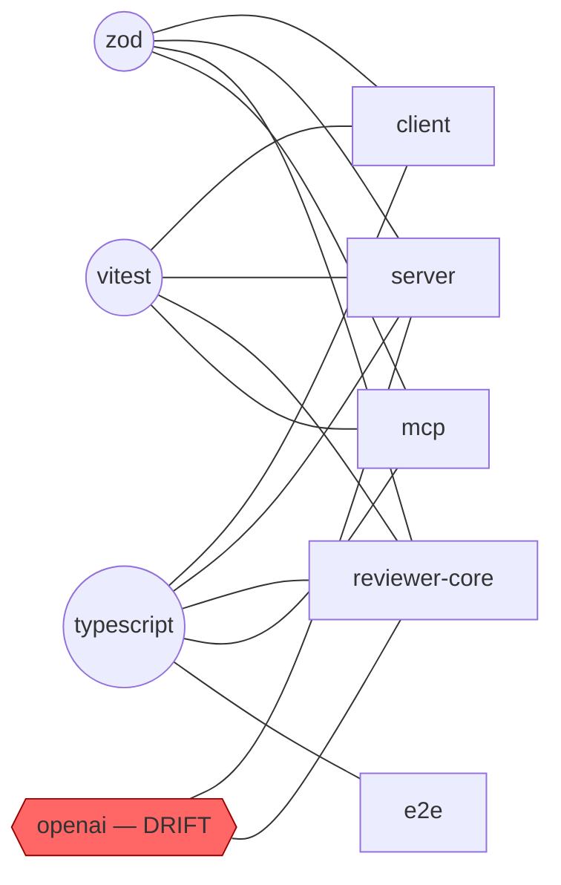

# Dependency Audit

This repo has **5 independent `package.json`s and no workspace root** — a
deliberate choice ([`CLAUDE.md`](../../../CLAUDE.md)), but it means nothing
dedupes dependencies across packages the way a pnpm workspace would. The same
library can drift to different versions in two packages, or get installed five
separate times, and nothing surfaces that automatically. This skill exists to
make that visible on request.

**Scope.** External npm dependencies only — version, size, and drift across
packages. Not this skill's job:

| Question | Where it belongs |
|---|---|
| Which ring/layer does this code belong to, what may it import? | `onion-architecture` (backend), `frontend-ui-architecture` (client) |
| Is this dependency vulnerable (CVE)? | `pnpm audit` / the `security` skill — this skill inventories, it doesn't scan for CVEs |
| Internal import graph between modules | repo-intel's `get_blast_radius` (server), not this skill |

## Step 1 — run the inventory script

```bash
node .claude/skills/dependency-checker/scripts/inventory.mjs <repo-root>
```

Pass the repo root (the directory containing `client/`, `server/`, etc.) —
omit it to use the current directory. It prints one JSON report to stdout and
finishes in a few seconds; it does **not** walk the full `node_modules` tree
(that can take minutes on this many packages) — it sizes only each package's
*direct* dependencies, each bounded to that one dependency's own installed
directory. Read the whole JSON before writing the report; don't re-derive any
of it by hand (no shelling out to `du`, no re-parsing `package.json` yourself
— the script already resolved dev/prod split, per-dependency size, lockfile
type, and cross-package sharing).

If a package has no `node_modules` yet, its dependencies still list
name/version/dev-or-prod, just with `size: null` — say so in the report
rather than guessing a size or silently omitting the package.

The JSON gives you, per package: `lockfile` (`pnpm`/`npm`/`yarn`/`none`),
`depCount`/`devDepCount`, and a `dependencies` map with `range`, `dev`, and
`size` (`bytes`/`human`/`files`) for each. At the top level:
`sharedDeps` (every dependency name → `{package: versionRange}` for every
package that has it) and `versionDrift` (pre-computed: only the entries of
`sharedDeps` where 2+ packages disagree on version) and
`mixedPackageManagers` (`true` if the 5 packages don't all use the same
lockfile type).

## Step 2 — draw the diagram

Build one Mermaid graph with a node per package plus a node per dependency
that is shared by **2 or more** packages — nothing else. A node per one of
the 40+ total unique dependencies would be unreadable and wouldn't show
anything a table doesn't already; the diagram's only job is to make sharing
and drift visually obvious at a glance, so restricting it to
`sharedDeps` entries with 2+ packages is what keeps it legible ("diagrams
should clarify, not decorate" — see the `mermaid-diagram` skill if you need
the general syntax reference).

Shape it hub-and-spoke — the shared dependency is the hub, the packages that
use it are the spokes — and mark a drifted dependency distinctly (e.g. a
different node shape or a `style` line) so it reads as a warning without
needing the legend read first:



(`{{...}}` + red fill for a drifted dependency, `((...))` circles for
aligned ones — any consistent distinction is fine, but pick one and use it
for every drifted node, not just the first.) If `versionDrift` is empty, the
diagram has no red nodes and the report should say plainly that nothing
drifted rather than manufacturing a finding.

## Step 3 — per-package breakdown

One table per package, sorted by size descending (largest dependency first —
that is almost always what a developer scanning this table is looking for).
Columns: dependency, version range, prod/dev, size. Round sizes to the
`human` field the script already computed; don't recompute or re-round.

Below each table, one line with the package's totals: dependency count
(prod + dev split) and lockfile type. If `nodeModulesExists` is `false`,
say the sizes are unavailable because the package isn't installed — don't
print a table of null sizes without explaining why they're null.

## Step 4 — cross-package findings

Two checks, always both, even if one comes back empty:

- **Version drift** — walk `versionDrift`. For each entry, name the
  dependency, which packages disagree, and their exact ranges. This is
  almost always the most actionable finding in the whole report: two
  packages relying on different major/minor versions of the same library is
  a bug waiting to happen (divergent behavior, or a painful upgrade later
  when they're forced to reconcile) that nothing else in this repo's tooling
  catches, since each package installs independently.
- **Mixed package managers** — if `mixedPackageManagers` is `true`, name
  which packages use which lockfile. A lockfile mismatch means one package's
  dependency resolution isn't reproducible the same way as its siblings'
  (`pnpm install` vs `npm install` can resolve the same ranges to different
  actual versions), and it's easy to miss because each package's install
  works fine in isolation — nothing fails until someone assumes pnpm
  semantics repo-wide.

Also worth a line, not a whole section: a dependency installed identically
in 3+ packages with real weight (say, over 10 MB each) is a visible cost of
having no workspace root — name the biggest one and its total footprint
across packages (sum the `size.bytes` for that name across every package
that has it). This isn't a "fix it" finding — no workspace root is a
deliberate choice here — just make the tradeoff's size legible.

## Step 5 — prioritize and advise

End with a short, ordered list — not a wall of generic advice. Order by
actionability, roughly:

1. **Version drift fixes** — each one, phrased as "bump `<package>` in
   `<lagging package>` from `<old>` to `<new>`" (pick the newer of the two
   ranges as the target unless something in the codebase suggests the older
   one was pinned deliberately — say so if you can't tell).
2. **Mixed package manager** — if present, one recommendation: standardize
   on one tool repo-wide (this repo's own `CLAUDE.md` already declares
   `pnpm ≥10`, so migrating the npm-lockfile packages to pnpm is the
   specific, concrete version of this recommendation here — not "pick a
   package manager").
3. **Heavy single-package dependencies worth a second look** — a dependency
   that's unusually large relative to what it's used for (judge from the
   package's own role, not a fixed byte threshold) is worth flagging with a
   lighter alternative if one is obvious — but don't invent a replacement
   suggestion you're not confident in; naming the size is still useful on
   its own.

Every recommendation names a specific package and a specific action — never
"consider auditing dependencies periodically" or other advice that doesn't
name a file, package, or version. A recommendation a developer can't act on
immediately is noise, and this report already has a wall of tables; padding
the end with generic advice is worse than a shorter list.

## Report structure

Chat output only — never write a file or open an Artifact unless the user
explicitly asks. Use this exact section order:

```markdown
# Dependency Audit

## Diagram
<the Mermaid graph from Step 2>

## Per-Package Breakdown
<one table per package, from Step 3>

## Cross-Package Findings
<version drift + mixed package managers + the workspace-root tradeoff line, from Step 4>

## Recommendations
<the ordered, specific list from Step 5>
```

If a section has nothing to report (no drift, no mixed managers), keep the
heading and write one line saying so — a missing section reads as "I forgot
to check," a present-but-empty one reads as "I checked, and it's clean."
