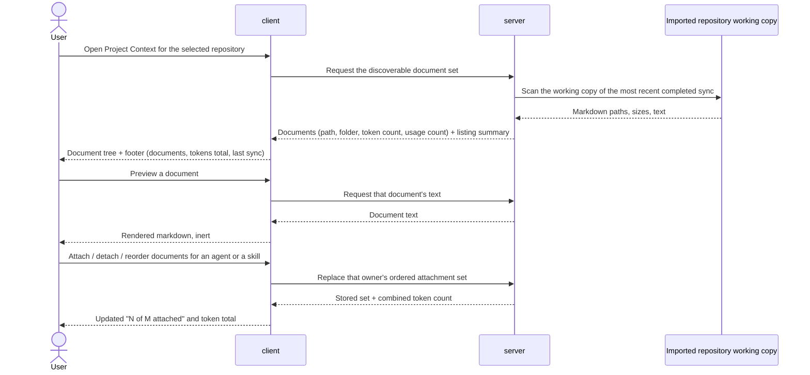
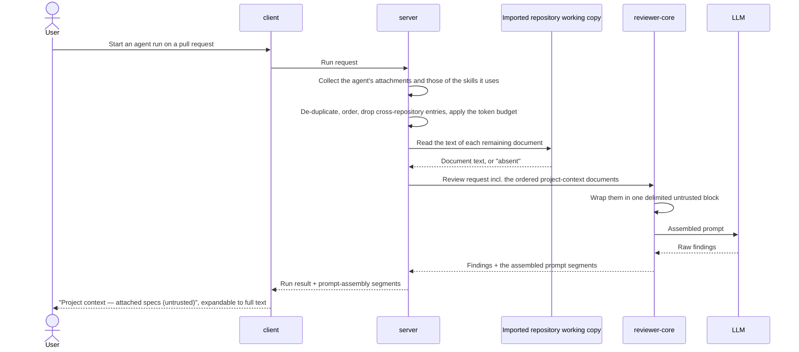

# SPEC-01: Project Context

Status: approved
Modules: client, server, reviewer-core
Supersedes: —
Superseded by: —
Design refs: `docs/specs/cross/_design/SPEC-01-project-context/01-project-context-page.png`,
`02-agent-context-tab.png`, `03-skill-context-tab.png`, `04-prompt-assembly.png`

## Problem & why

A reviewing agent today knows the diff and what the indexer derived from the
code, but nothing about what the team has *written down* — the specs, design
notes, incident write-ups and conventions that live as markdown in the
repository itself. Reviewers keep re-explaining rules that are already
documented, and findings contradict decisions the project made months ago.

The documents exist and are already synced into the workspace with the
repository. What is missing is a way to (a) see them, (b) decide which of them
a given agent or skill should carry, (c) see what that decision costs in
tokens *before* a run, and (d) verify afterwards exactly what text reached the
model.

Because these documents are third-party text authored outside DevDigest, the
same feature that makes them useful also makes them a prompt-injection
surface. That is why the injected block is specified as untrusted data
throughout, not as an afterthought.

## Goals / Non-goals

**Goals**

- Browse every markdown document in the imported repository's working copy.
- Read a rendered preview of any of them.
- Attach documents to an agent, and to a skill (inherited by every agent using
  that skill), with a user-controlled order.
- Show a deterministic token count per document and per attached set, at
  selection time, with no model call.
- Inject the attached documents' full text into every run of that agent, as
  one clearly delimited untrusted block.
- Let the user read back, from a finished run, the exact project-context text
  that was sent.

**Non-goals** — explicitly not part of this feature:

- Creating, editing, uploading, renaming or deleting documents. The `Edit`
  toggle and the new-file / new-folder / upload icons in mockup 01 are future
  work and are inert in this scope.
- Chunking, embedding or any semantic retrieval over the documents. The
  footer states a token total, **not** a chunk count; the mockup's
  "1,240 chunks" is superseded by "1,240 tokens total".
- The COVERAGE ring in mockup 01, and the pull% / accept% statistics visible
  on the skill and agent cards. The only document metric in scope is the
  usage count. The ring is not rendered at all — it is not shown as
  unavailable, and nothing occupies that space.
- Non-markdown documents of any kind, and documents from anywhere other than
  the imported repository's working copy.
- Reading attached documents from the pull request's head commit. Documents
  are always read from the working copy of the most recent completed sync,
  even when the pull request under review changes one of them.
- Per-run overrides of the attached set: a run uses the agent's stored set.
- Automatically re-pointing an attachment when a document is renamed or moved.
- Any change to how skills, memory, repo skeleton or diff segments are
  assembled; this feature adds one segment and touches no other.

## User stories

- **US-1** As a reviewer configuring the workspace, I want to see every
  markdown document in the repository in one place, so that I know what
  written context exists at all.
- **US-2** As a reviewer, I want to read a document without leaving DevDigest,
  so that I can judge whether it is worth attaching.
- **US-3** As an agent author, I want to attach specific documents to an agent
  and control their order, so that the agent reviews against our written
  rules.
- **US-4** As a skill author, I want to attach documents to a skill, so that
  every agent using that skill inherits them without repeating the choice.
- **US-5** As an agent author, I want to see how many tokens my selection adds
  before I run anything, so that I do not discover the cost after a review.
- **US-6** As a reviewer reading a finished run, I want to see the exact
  project-context text that was sent, so that I can explain or dispute a
  finding.
- **US-7** As someone responsible for the workspace, I want document text to
  reach the model as data and never as instructions, so that a document
  authored by a third party cannot redirect the review.

## Workflow & module interaction

Browsing and attaching:

Assembling a run:

## Contracts (shape only)

**Discoverable set** — for one repository, the markdown files present in its
working copy as of the most recent completed sync, excluding the classes named
in AC-2, ordered by ascending repository-relative path, capped at the
discovery limit. Ordering is defined (not unspecified) so that a partial
listing is reproducible.

**Discoverable document** — carries its repository-relative path, its
containing folder (used as the source badge in mockups 02 and 03), its size,
its token count, and its usage count. Two documents with the same file name in
different folders are distinct and are distinguished by path.

**Listing summary** — the number of documents listed, their combined token
count, and the time of the most recent completed sync. It carries no chunk
count and no coverage figure.

**Usage count** — for one document, the number of distinct agents whose
assembled project context would include it, counting an agent once whether it
reaches the document directly, through a skill, or both. Agents and skills
that are currently disabled are counted: the enable toggle is transient, and
the count answers "who carries this document", not "who is running today".

**Attachment** — an ordered entry belonging to exactly one owner (an agent or
a skill), identifying a document by repository and repository-relative path.
An owner's attachments form one ordered list; the whole list is replaced as a
unit, so the last write wins.

**Assembled project context** — computed for one agent at run start: an
ordered, de-duplicated list of entries, each carrying a document's
repository-relative path and its full text as of the most recent completed
sync; plus a list of attachments that were *not* included, each with the
reason (absent from the working copy, outside the pull request's repository,
or beyond the token budget).

**Project-context block** — the single delimited region of the prompt that
carries the assembled project context, marked as untrusted repository content,
with each document's path stated before its text.

**Prompt-assembly segment** — for a finished run, a labelled, expandable entry
carrying the exact text of one prompt block. The project-context segment
exists for a run exactly when that run's prompt contained a project-context
block.

## Acceptance criteria (EARS)

**Browsing**

- **AC-1** WHEN the user opens the Project Context page for a repository whose
  working copy has completed at least one sync, the system SHALL present every
  document of that repository's discoverable set, grouped by containing
  folder.
- **AC-2** The system SHALL exclude from the discoverable set every file that
  is not a markdown file, every file inside a dependency, build-output or
  version-control directory, every markdown file larger than the maximum
  document size, and every path that resolves outside the repository's working
  copy.
- **AC-3** IF a synced repository's discoverable set is empty, THEN the system
  SHALL present an empty state stating that the repository contains no
  markdown documents.
- **AC-4** WHILE the selected repository has not completed a working-copy
  sync, the system SHALL present the document listing as unavailable and SHALL
  NOT present the empty-set message.
- **AC-5** WHEN the user requests a preview of a document, the system SHALL
  present that document's markdown rendered as inert content.
- **AC-6** The system SHALL present, for each document in the discoverable
  set, that document's token count.
- **AC-7** WHILE a repository's document listing is presented, the system
  SHALL display the combined token count of the listed documents.
- **AC-8** The system SHALL present, for each document in the discoverable
  set, its usage count.

**Attaching**

- **AC-9** WHEN the user attaches a document to an agent or to a skill, the
  system SHALL include that document in that owner's attached set on every
  subsequent read of that owner, including after the application is reloaded.
- **AC-10** WHEN the user attaches or detaches a document, the system SHALL
  update the displayed combined token count of that owner's attached set
  without starting a review run.
- **AC-11** WHERE an agent uses a skill that has attached documents, the
  system SHALL include those documents in that agent's assembled project
  context.
- **AC-12** IF a document is reachable both through an agent's own attachment
  and through a skill that agent uses, THEN the system SHALL include that
  document exactly once in the assembled project context.
- **AC-13** The assembled project context SHALL place documents inherited from
  skills before the agent's own attached documents, each group in the order
  its owner defined.
- **AC-14** WHILE the document filter on a context view is non-empty, the
  system SHALL NOT permit reordering of that owner's attached documents.
- **AC-15** WHEN the user issues a move-up or move-down command from a focused
  document row using the keyboard alone, the system SHALL change that
  document's position by one in the requested direction while keeping focus on
  that document.
- **AC-16** WHEN a document's position in an owner's attached order changes,
  the system SHALL announce the document's identity and its new position to
  assistive technology.
- **AC-17** IF an owner's attached set has a combined token count above the
  project-context token budget, THEN the system SHALL present, on that owner's
  context view, a warning that the budget is exceeded.
- **AC-18** IF an attached document is absent from the repository's current
  working copy, THEN the system SHALL present that attachment as missing on
  the owner's context view.

**Injecting into a run**

- **AC-19** WHEN an agent run starts and the agent's assembled project context
  is non-empty, the prompt sent to the model SHALL contain the full text of
  every document in that context, as of the repository's most recent completed
  sync.
- **AC-20** The system SHALL place all project-context document text inside a
  single delimited block marked as untrusted repository content, and SHALL NOT
  reproduce that text anywhere else in the prompt.
- **AC-21** IF a project-context document contains text formatted as an
  instruction, THEN the prompt's instruction sections SHALL be identical to
  those of the same run with no project context attached.
- **AC-22** WHERE the pull request under review belongs to a repository other
  than the one an attached document was discovered in, the system SHALL
  exclude that document from the assembled project context.
- **AC-23** IF an attached document is absent from the working copy when a run
  starts, THEN the system SHALL exclude it from the assembled project context.
- **AC-24** IF including the next document would take the assembled project
  context above the project-context token budget, THEN the system SHALL
  exclude that document and every later document in the order, and SHALL NOT
  include any document in part.
- **AC-25** IF an agent's assembled project context is empty when a run
  starts, THEN the run's prompt SHALL NOT contain a project-context block.

**Reading it back**

- **AC-26** WHILE a finished run's prompt contained a project-context block,
  the run's prompt-assembly view SHALL list a segment that names it as
  attached project context and marks it as untrusted.
- **AC-27** WHEN the user expands a run's project-context segment, the system
  SHALL present the exact text of the project-context block that was sent in
  that run's prompt.
- **AC-28** IF an attachment was excluded from a run's assembled project
  context, THEN the run's prompt-assembly view SHALL identify that document
  and the reason it was excluded.

## Edge cases

- **Hundreds of markdown files.** The discoverable set is capped at the
  discovery limit in ascending path order; when the cap is reached the listing
  is marked partial and states how many files were not listed. The filter box
  is the way to reach a document beyond the cap's visible portion.
- **A document larger than the budget on its own** is never included in part
  (AC-24), so it is always excluded — the warning of AC-17 is the only signal
  the user gets before running.
- **Rename or move.** An attachment identifies a document by path, so a rename
  is a delete plus an add: the old attachment shows as missing (AC-18) and the
  new path appears as an unattached document. Nothing is re-linked
  automatically.
- **Content changed between attaching and running.** The run uses the text as
  of the most recent completed sync (AC-19); no snapshot is taken at attach
  time. The token count shown at selection time may therefore differ from the
  count at run time.
- **Attachment changed while a run is in flight.** The run uses the set
  captured when it started; a change made afterwards affects the next run.
- **Two clients editing the same owner's attachments.** The ordered list is
  replaced as a unit, so the later write wins and silently discards the
  earlier ordering. No merge is attempted.
- **Zero attached documents** — no block, no segment (AC-25, and the segment
  contract), so a run looks exactly as it does today.
- **Exactly one attached document** — the block still exists, with one entry;
  ordering is trivially satisfied.
- **Filter matches nothing** — the list is empty and states that no document
  matches; attachments already made are unaffected and still count towards the
  totals.
- **A document that is not valid UTF-8, or is markdown in name only** is
  treated as not readable and excluded from the discoverable set.
- **Very long or deeply nested paths** are shown truncated, with the full path
  available on the row.
- **Repository never synced, or sync in progress** — AC-4; the page does not
  claim the repository has no documents.
- **A document attached to a skill that no agent uses** has a usage count of
  zero and is never injected.

## Non-functional requirements

- The document listing for a working copy of up to 2,000 markdown files SHALL
  be presented within 2 seconds of the user opening the page.
- Token counts SHALL be produced without any model call.
- Two documents with identical content SHALL produce identical token counts,
  and the same document SHALL produce the same count on repeated reads.
- A document's token count SHALL be the same number regardless of which agent
  or skill it is attached to and regardless of the model that agent is
  configured with. A per-model exact count was rejected: the same document
  would then show different numbers on different agents, and the combined
  total in the listing footer would have no defined meaning.
- The maximum document size SHALL be 256 KB.
- The discovery limit SHALL be 2,000 documents per repository.
- The project-context token budget SHALL be 20,000 tokens per run.
- The four numeric limits above — 2 seconds / 2,000 files, 256 KB, 2,000
  documents and 20,000 tokens — are initial values chosen without measurement.
  They are settled requirements for this iteration and are expected to be
  revisited once real repositories have been indexed against them.
- Document listings, document text and attachment changes SHALL be served only
  for repositories, agents and skills belonging to the requesting user's
  workspace.
- Text and non-decorative indicators, including token counts and source-folder
  badges, SHALL meet a contrast ratio of at least 4.5:1 against their
  background.
- Every control that acts on a single document — the attach toggle, the
  reorder handle and the preview control — SHALL have an accessible name that
  identifies both the action and the document it acts on.
- Interactive targets in the document rows SHALL be at least 24×24 CSS pixels.
- A document's source folder SHALL be conveyed by text and not by badge colour
  alone.

## Inputs and provenance

| Input | Provenance |
|---|---|
| Markdown document paths, sizes and text | `[deterministic: imported repository working copy]` |
| Time of the most recent completed sync | `[reused: existing repository sync state]` |
| Per-document and per-set token counts | `[deterministic: uniform token counting, no model call]` |
| Usage count per document | `[deterministic: stored attachments]` |
| Rendered preview | `[deterministic: markdown rendering]` |
| Assembled project context for a run | `[deterministic: attachments + working copy, no model call]` |
| Project-context prompt segment and its text | `[reused: existing run prompt-assembly trace]` |
| Agent's skill list, used for inheritance | `[reused: existing agent–skill links]` |

This feature adds **0 LLM calls**. It increases the input token count of every
run of an agent that has a non-empty assembled project context, by that
context's token count.

## Untrusted inputs

Foreign text this feature reads:

- **Markdown document text** from the imported repository's working copy —
  authored by whoever contributed to that repository, not by the DevDigest
  user. This is the primary injection surface.
- **Document paths and file names** from the same working copy, which are
  echoed into the prompt as labels and into the UI as row text.
- **Pull request title, body and diff** — already handled by the existing
  review pipeline; unchanged here, but they now share a prompt with document
  text.

Handling:

- Document text and document paths are injected as **data** inside one
  delimited block marked untrusted (AC-20), never appended to, merged into, or
  used to modify any instruction section of the prompt (AC-21).
- No document may cause a prompt block other than the project-context block to
  change; a run with an injection-laden document differs from a run without it
  only in the contents of that block.
- Rendered previews present markdown as inert content: no scripts, no embedded
  active content, and no automatic requests to addresses named in the
  document.
- Paths are resolved against the repository's working copy and any path
  escaping it is excluded (AC-2), so an attachment cannot be used to read a
  file elsewhere on the machine.
- Findings remain subject to the existing requirement that they cite the diff;
  a document cannot introduce a finding that is not grounded in the pull
  request.

## Traceability

| AC | Verified by |
|---|---|
| AC-1 | server integration |
| AC-2 | unit |
| AC-3 | unit |
| AC-4 | unit |
| AC-5 | unit |
| AC-6 | unit |
| AC-7 | unit |
| AC-8 | server integration |
| AC-9 | server integration |
| AC-10 | unit |
| AC-11 | server integration |
| AC-12 | unit |
| AC-13 | unit |
| AC-14 | unit |
| AC-15 | unit |
| AC-16 | unit |
| AC-17 | unit |
| AC-18 | unit |
| AC-19 | server integration |
| AC-20 | unit |
| AC-21 | unit |
| AC-22 | server integration |
| AC-23 | server integration |
| AC-24 | unit |
| AC-25 | unit |
| AC-26 | e2e flow |
| AC-27 | e2e flow |
| AC-28 | server integration |

## Open questions

None. Every question raised while drafting has been decided; the decisions are
recorded where they bind, and are listed here only so a later reader does not
have to rediscover that the alternatives were considered.

| Decision | Where it binds |
|---|---|
| One uniform, deterministic token count per document, identical across agents and models; per-model exact counting rejected | Non-functional requirements, AC-6, AC-7 |
| Maximum document size 256 KB; discovery limit 2,000 documents; project-context budget 20,000 tokens; listing within 2 s for 2,000 files — initial values, revisited after measurement | Non-functional requirements, AC-2, AC-24 |
| Exceeding the budget truncates by whole documents; it never blocks the run and never includes a document in part | AC-24, AC-28 |
| Skill-inherited documents precede the agent's own attachments | AC-13 |
| A document attached from another repository is ignored for a run on this one | AC-22 |
| Documents are read from the working copy of the most recent completed sync, never from the pull request's head commit | AC-19, Non-goals |
| The usage count includes disabled agents and disabled skills | Contracts, AC-8 |
| The listing footer states documents, tokens total and last sync; no chunk count, and the COVERAGE ring is not rendered at all | Non-goals, AC-7 |
