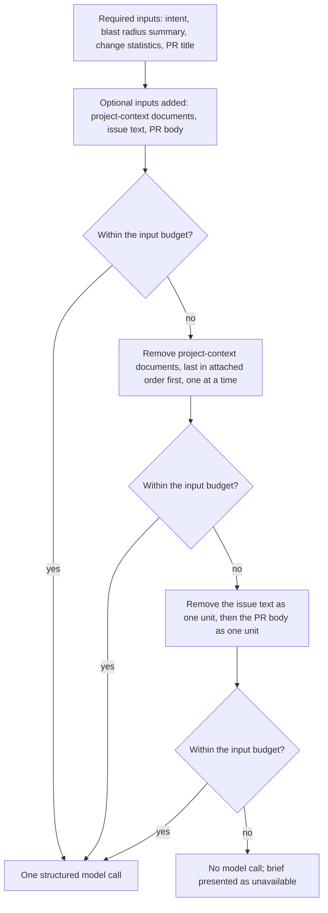

# SPEC-02: PR Brief

Status: approved
Modules: client, server, reviewer-core
Supersedes: —
Superseded by: —
Design refs: `docs/specs/cross/_design/SPEC-02-pr-brief/1.png`, `2.png`,
`3.png`, `4.png`, `5.png`, `6.png`, `7.png`

## Problem & why

Opening a pull request in DevDigest today drops the reviewer straight into
scope lists, a blast radius and a diff. Nothing on the page answers the two
questions a reviewer actually starts with — *what does this change, and why* —
in a form shorter than reading the diff. The pull request's own title is not
that answer: it is written before the work is finished, by the author, to
label a branch.

The pieces needed to answer both questions already exist and are already paid
for. Intent and scope are derived once per pull request (L03). The blast
radius already produces a one-line summary of what the change reaches (L04).
The project's written documents can already be attached and injected (SPEC-01).
What is missing is a short, cached synthesis of them, plus the two things that
synthesis makes possible: a list of concrete risk areas anchored in real files,
and an ordered "read these first" list that tells a reviewer where to start.

Two things make this worth specifying carefully rather than just prompting for
prose. First, everything the brief is built from is foreign text — a pull
request body, an issue body and repository documents are all authored outside
DevDigest, so the brief is a prompt-injection surface by construction. Second,
a brief whose file references do not exist is worse than no brief at all: it
sends the reviewer to files that are not in the change. Grounding and a fixed
input budget are therefore requirements, not tuning.

## Goals / Non-goals

**Goals**

- Present, above everything else on a pull request's overview, a short
  statement of what the change does and why it is being made.
- Present a model-produced risk level for the change as a whole.
- Present the PR score, verdict and finding/blocker counts of the most recent
  agent run, and present nothing where there has been no run.
- Let the user force a rebuild of the brief at any time.
- Present concrete risk areas as a subsection of the existing intent card, each
  anchored in files the change actually touches, each expandable to its
  explanation.
- Present an ordered "review focus" list saying what to check first, anchored
  in the same way.
- Build all of the above from one model call over inputs that never include a
  diff hunk body, and cache the result for the exact pull request state it was
  built from.

**Non-goals** — explicitly not part of this feature:

- **Per-brief cost and token accounting.** The cost line visible in mockups 1
  and 2 (`$0.014  8.2K→1.3K`) is not rendered at all — it is not shown as
  unavailable, and nothing occupies that space.
- Producing, deriving or implying a score. A score comes from an agent run and
  from nothing else; a brief never creates one.
- Searching the repository, the issue tracker or anywhere else for a related
  issue. Only an issue the pull request's own title or body references is used.
- Indexing, chunking, embedding or searching for relevant specs. Specs reach
  the brief only through the already-attached project-context documents that
  SPEC-01 defines.
- Re-generating a brief when intent, blast radius or agent runs change. The
  head commit and the rebuild controls are the only two routes to a new brief.
- Sending diff hunk bodies to the model on this path. The brief is built from
  derived facts, not from the diff text.
- Editing, annotating, dismissing or commenting on a brief, a risk or a
  review-focus item.
- Any change to how agent runs, findings, verdicts or scores are produced. This
  feature reads those values and changes none of them.

## User stories

- **US-1** As a reviewer opening a pull request, I want a two-sentence
  statement of what it changes and why, so that I can decide how much attention
  it needs before reading any code.
- **US-2** As a reviewer, I want that statement to tell me something the title
  does not, so that reading it is not wasted effort.
- **US-3** As a reviewer, I want the PR score, verdict and finding counts in the
  same place as the brief, so that I see the model's summary and the review's
  outcome together.
- **US-4** As a reviewer looking at a pull request nobody has run an agent on,
  I want the absence of a score to be obvious, so that I do not read "no score"
  as "score of zero".
- **US-5** As a reviewer, I want a list of concrete risk areas pointing at real
  files, so that I can jump from a risk straight to the code it concerns.
- **US-6** As a reviewer, I want an ordered list of what to read first, so that
  a large diff has a defined starting point.
- **US-7** As a reviewer who has just pushed a commit, I want the brief to
  reflect the new state rather than the old one, without having to remember to
  refresh it.
- **US-8** As a reviewer who thinks the brief is wrong or stale, I want to force
  a rebuild, so that I am never stuck with a bad summary.
- **US-9** As someone responsible for the workspace, I want a hostile pull
  request body or issue body to be unable to redirect the brief, so that the
  summary describes the change rather than what its author asked the model to
  say.

## Workflow & module interaction

Opening the overview, with and without a cached brief:

```mermaid
sequenceDiagram
  actor User
  participant Client as client
  participant Server as server
  participant Core as reviewer-core
  participant LLM

  User->>Client: Open the overview view of a pull request
  Client->>Server: Brief request for this pull request
  Server->>Server: Look up the stored brief for the head commit
  alt A stored brief exists for this head commit
    Server-->>Client: Stored brief, no model call
  else No stored brief for this head commit
    Server->>Server: Collect intent (L03) and blast radius summary (L04)
    Server->>Server: Collect per-file change statistics
    Server->>Server: Resolve an issue referenced by the PR title or body
    Server->>Server: Collect attached project-context documents (SPEC-01)
    Server->>Server: Count tokens; drop optional inputs until within budget
    Server->>Core: Brief input, carrying no diff hunk body
    Core->>Core: Wrap all foreign text in one delimited untrusted block
    Core->>LLM: One structured call
    LLM-->>Core: what, why, risk level, risks, review focus
    Core->>Core: Drop ungrounded references, then reference-less items
    Core-->>Server: Grounded brief
    Server->>Server: Store the brief against the head commit
    Server-->>Client: Brief
  end
  Client-->>User: Brief card, risk areas, review focus
  Client->>Server: Run summary request for this pull request
  Server-->>Client: Verdict, finding count, blocker count, score, or none
  Client-->>User: Verdict and PR score, or the no-run state
```

Fitting the assembled input into the budget:



## Contracts (shape only)

**Brief** — carries a *what* statement, a *why* statement, a risk level, an
ordered list of risks, an ordered list of review-focus items, and the identity
of the head commit it was produced for. At most one brief is stored per pull
request per head commit. A brief carries no score, no verdict and no finding
counts: those belong to an agent run, not to a brief. A brief is always
produced, stored and replaced whole — there is no path that rebuilds its risks
without also rebuilding its what, why, risk level and review-focus items.

**What statement** — one short statement of what the change does, in terms of
the behaviour or the surface it affects. It is not a restatement of the pull
request's title (AC-2).

**Why statement** — one short statement of the reason the change is being made,
drawn from the intent, the referenced issue and the pull request body.

**Risk level** — one of three ordered levels (high, medium, low), produced by
the model, describing the change as a whole. It is a different quantity from
the PR score, produced by a different mechanism at a different time, and the
two are never derived from each other.

**Risk** — carries a kind, a title, an explanation, a severity from the same
three ordered levels, and at least one file reference. A risk with no surviving
file reference does not exist (AC-20).

**Review-focus item** — carries at least one file reference and a short reason
stating what to check there. Its position in the list is its rank: the list is
ordered most-important-first by the generation that produced it, and that order
is preserved on every later read (AC-24).

**File reference** — a repository-relative path that is present in the pull
request's changed files, optionally narrowed to a line or a line range. It is
the navigation target of AC-25. Two identical references within one item are
one reference.

**Per-file change statistics** — for each changed file, its path and its added
and removed line counts. The set is capped at the change-statistics file limit,
ordered by descending changed-line count with ties broken by ascending path,
and carries a count of the files not listed. It carries no hunk body and no
line content.

**Brief input** — the assembled data a generation sends: the intent, the blast
radius summary, the per-file change statistics, the pull request's title and
body, the referenced issue's text when one is resolved, and the text of the
attached project-context documents. Everything in it other than the intent's
own structure is foreign text (see **Untrusted inputs**).

**Run summary** — the verdict, the finding count, the blocker count and the
score of the most recent completed agent run on a pull request. It is a single
unit with a single provenance: either all four values are present, or the pull
request has had no completed run and none of them exist. It is not part of the
brief and is not stored with it.

**Issue reference** — an issue identified by the pull request's own title or
body. Nothing else is consulted; a pull request that names no issue has no
issue reference, which is a normal state and not an error.

## Acceptance criteria (EARS)

**Reaching and reading the brief card**

- **AC-1** WHEN the user opens the overview view of a pull request that has a
  stored brief for its head commit, the system SHALL present, above every other
  element of that view, that brief's what statement, why statement and risk
  level.
- **AC-2** A stored brief's what statement SHALL differ from its pull request's
  title when both are compared in lower case with leading, trailing and
  repeated whitespace removed.
- **AC-3** The brief card SHALL present the verdict, the finding count and the
  blocker count of the most recent completed agent run on that pull request.
- **AC-4** The brief card SHALL present, as the PR score, the score of the most
  recent completed agent run on that pull request, and that value SHALL equal
  the score the pull request list presents for the same pull request.
- **AC-5** IF a pull request has no completed agent run, THEN the brief card
  SHALL present the PR score as unavailable and SHALL NOT present a verdict, a
  finding count or a blocker count.

**Generating, caching and rebuilding**

- **AC-6** WHEN the user opens the overview view of a pull request that has no
  stored brief for its head commit, the system SHALL start exactly one brief
  generation for that pull request.
- **AC-7** WHILE a brief generation is in progress for a pull request, the
  system SHALL present the brief card as generating and SHALL NOT present a
  partial brief.
- **AC-8** WHEN a brief is requested for a pull request whose head commit has a
  stored brief, the system SHALL present that stored brief without performing a
  model call.
- **AC-9** IF a pull request's head commit differs from the head commit its
  stored brief was produced for, THEN the system SHALL treat that pull request
  as having no stored brief.
- **AC-10** WHEN a pull request's intent is recomputed, its blast radius is
  recomputed, or an agent run on it completes, the system SHALL leave the
  stored brief for that pull request's head commit unchanged.
- **AC-11** WHEN the user activates the regenerate control on the brief card or
  the recalculate control in the risk areas subsection, the system SHALL replace
  the whole stored brief for the pull request's head commit with the result of a
  single new model call, whether or not a stored brief already exists for that
  head commit.
- **AC-12** WHEN a brief is generated for a pull request that has no completed
  agent run, the system SHALL store that brief and SHALL NOT create a score for
  that pull request.
- **AC-13** IF a brief generation fails, THEN the system SHALL present the brief
  card as unavailable and SHALL leave any previously stored brief for that head
  commit unchanged.

**Assembling the input**

- **AC-14** The input assembled for a brief generation SHALL contain the pull
  request's intent, the blast radius summary, the per-file change statistics,
  the referenced issue's text when an issue reference is resolved, and the text
  of the project-context documents attached for that generation.
- **AC-15** The input assembled for a brief generation SHALL NOT contain any
  diff hunk body.
- **AC-16** IF no issue reference is resolved from the pull request's title and
  body and no project-context document is attached, THEN the system SHALL
  produce the brief from the remaining inputs.
- **AC-17** IF the assembled brief input exceeds the brief input budget, THEN
  the system SHALL remove optional inputs whole, in the defined drop order,
  until the assembled input is within the budget.
- **AC-18** IF the assembled brief input exceeds the brief input budget after
  every optional input has been removed, THEN the system SHALL NOT perform the
  model call and SHALL present the brief card as unavailable.

**Grounding the result**

- **AC-19** IF a risk or a review-focus item in the model's response references
  a file or an endpoint that is absent from that generation's assembled input,
  THEN the system SHALL remove that reference from the item.
- **AC-20** IF a risk or a review-focus item has no reference remaining after
  ungrounded references are removed, THEN the system SHALL remove that item
  from the brief.

**Risk areas**

- **AC-21** The intent card SHALL present a risk areas subsection listing the
  stored brief's risks in descending severity order, with risks of equal
  severity in the order they appear in the stored brief.
- **AC-22** WHILE a risk row has not been expanded, the system SHALL NOT present
  that risk's explanation.
- **AC-23** WHEN the user activates a risk row's expand control using the
  keyboard alone, the system SHALL present that risk's explanation.

**Review focus and navigation**

- **AC-24** The overview view SHALL present the review focus section below the
  intent card, listing the stored brief's review-focus items in the order they
  appear in the stored brief and stating a count equal to the number of items
  it lists.
- **AC-25** WHEN the user activates a file reference in a risk row or in a
  review-focus item, the system SHALL present the changed-files view of that
  pull request positioned at the referenced file.

**Prompt integrity**

- **AC-26** IF the pull request body, the referenced issue's text or an attached
  project-context document contains text formatted as an instruction, THEN the
  instruction sections of the brief prompt SHALL be identical to those of a
  generation whose inputs contain no such text.

## Edge cases

- **Reopening a pull request whose state has not changed.** The head commit is
  unchanged, so the stored brief is read and no model call is made (AC-8). This
  is the common case and the one the cache exists for.
- **A brief that is stale relative to newer inputs.** Because the head commit is
  the only cache key, recomputing intent, recomputing the blast radius or
  running an agent again leaves the stored brief untouched (AC-10). A brief can
  therefore describe the change using an older intent, or sit next to a verdict
  from a run it knows nothing about. This is accepted: the alternative — a
  model call on every upstream recompute — costs money on events the reviewer
  did not ask about. The remedy is a rebuild control (AC-11), and it is the
  only remedy.
- **Intent derived from an earlier commit.** Intent is stored per pull request,
  not per commit, so a brief generated for a new head commit may embed an intent
  derived before that commit existed. The brief is still generated; nothing
  blocks on the intent being current.
- **A new commit arrives while a generation is running.** The result is stored
  against the head commit the generation started from. The newer head commit has
  no stored brief, so the next open starts a generation for it (AC-6, AC-9).
- **Two clients opening the same pull request at once.** Both may find no stored
  brief and start a generation. The cost is at most one wasted model call and
  the later write wins; no duplicate brief is stored for one head commit.
- **A pull request with completed runs but no brief.** The verdict, counts and
  score are presented immediately from the run (AC-3, AC-4) while the brief text
  is still generating (AC-7). The two halves of the card fill in independently.
- **A pull request that has never been run.** The brief can be generated and
  presented in full; the score area states that no score exists (AC-5). A brief
  is never evidence that a review happened.
- **A brief with no risks.** The risk areas subsection is presented and states
  that no risk areas were identified. It is not hidden — a hidden subsection is
  indistinguishable from a subsection that failed to load.
- **A brief with no review-focus items,** including the case where grounding
  removed all of them (AC-20). The section is presented with a count of zero and
  states that no starting point was identified.
- **Duplicate file references within one item.** Mockup 6 shows one review-focus
  item carrying the same path twice. Identical references within a single item
  are presented once.
- **A pull request with no changed files.** The change statistics are empty and
  every model-produced file reference is therefore ungrounded and removed
  (AC-19), leaving a brief with what, why and a risk level only.
- **A pull request with more changed files than the change-statistics file
  limit.** The statistics carry the highest-churn files in the defined order
  plus a count of those not listed; they are never truncated mid-file.
- **Very long what or why text.** Presented in full and wrapped. No truncation
  rule is defined, because a truncated summary is a summary that cannot be
  trusted.
- **A file reference pointing at a deleted or renamed file.** A deleted file is
  part of the change, so the reference is grounded and navigation positions the
  changed-files view at it. A reference to a path that is not in the change is
  removed by AC-19 regardless of whether it exists in the repository.
- **Stale line ranges.** A line range can only go stale when the head commit
  changes, and that invalidates the whole brief (AC-9), so a stored brief never
  carries a line range from a different commit.
- **Records written before this feature.** The brief persistence slot is
  currently unused, so no stored brief predates this specification and no
  migration of old brief shapes is required. Pull requests, intents and runs
  that predate it are read as they are: a pull request with an intent but no
  brief is the ordinary first-open case (AC-6).
- **A hostile brief input.** Covered under **Untrusted inputs**; the observable
  requirement is that the prompt's instruction sections are unchanged by it.

## Non-functional requirements

- The assembled brief input SHALL NOT exceed 8,000 tokens.
- The system SHALL NOT perform a brief model call with an input whose token
  count exceeds 8,000 tokens.
- Token counts for the brief input SHALL be produced by the same deterministic,
  model-independent counter SPEC-01 defines, without any model call.
- The same assembled brief input SHALL produce the same token count on repeated
  counts, and that count SHALL NOT depend on the model the generation uses.
- A brief generation SHALL perform exactly one model call.
- The change-statistics file limit SHALL be 300 files.
- The two numeric limits above — the 8,000-token input budget and the 300-file
  change-statistics limit — are initial values chosen without measurement. They
  are settled requirements for this iteration and are expected to be revisited
  once real pull requests have been measured against them.
- Brief generation SHALL be limited to at most 20 generations per minute per
  workspace, this being a path that spends money on every call.
- A brief SHALL be produced, stored and served only for pull requests belonging
  to the requesting user's workspace, on every path including the path that
  reads a stored brief without generating one.
- The regenerate control, the recalculate control, each risk row's expand
  control and each file reference SHALL have an accessible name that identifies
  both the action and the pull request, risk or file it acts on.
- A risk row's expand control SHALL expose whether that row is currently
  expanded or collapsed.
- A risk's severity SHALL be conveyed by text and not by icon or colour alone.
- The verdict SHALL be conveyed by text and not by colour alone.
- Text and non-decorative indicators in the brief card, the risk areas
  subsection and the review focus section — including the risk level, the
  verdict, the counts, the score and every file reference — SHALL meet a
  contrast ratio of at least 4.5:1 against their background.
- Interactive targets in risk rows and review-focus rows, and the regenerate and
  recalculate controls, SHALL be at least 24×24 CSS pixels.

## Inputs and provenance

| Input | Provenance |
|---|---|
| Pull request intent, in-scope and out-of-scope lists | `[reused: L03 intent]` |
| Blast radius summary text | `[reused: L04 blast summary]` |
| Per-file change statistics | `[deterministic: the pull request's changed files]` |
| Pull request title and body | `[deterministic: the imported pull request]` |
| Referenced issue title and body | `[deterministic: issue reference resolved from the pull request's own title and body]` |
| Attached project-context documents | `[reused: SPEC-01 project context]` |
| Token counts for the assembled input | `[deterministic: SPEC-01 token counter, no model call]` |
| Head commit identity, used as the cache key | `[deterministic: the pull request's head commit]` |
| What, why, risk level, risks and review-focus items | `[new: 1 LLM call]` |
| Grounding of every file and endpoint reference | `[deterministic: the assembled input, no model call]` |
| Verdict, finding count, blocker count and score | `[reused: the most recent completed agent run]` |

Total per generation: **exactly 1 model call**. Total per cache read:
**0 model calls**. Nothing on this feature's paths performs a second call, and
no path other than a generation performs one at all.

## Untrusted inputs

Foreign text this feature reads:

- **Pull request title and body** — authored by the pull request's author, who
  is not the DevDigest user. The primary injection surface, because it is the
  one input an outside contributor controls directly and deliberately.
- **The referenced issue's title and body** — authored by whoever filed the
  issue, reached through a reference the pull request itself carries.
- **Project-context document text** — already established as untrusted by
  SPEC-01, and unchanged here.
- **File paths and symbol names from the repository**, which reach the input
  through the change statistics and the blast radius summary and are echoed back
  into the interface as row text and reference labels.
- **The intent text**, which is model output derived from the pull request title,
  body and diff, and is therefore an indirect carrier of all of the above.
- **The model's own response** — the what, why, risks and review-focus text is
  generated from untrusted inputs and is treated as data on the way out as well
  as on the way in.

Handling:

- Every item above enters the prompt as **data**, inside one delimited block
  marked as untrusted, never appended to or merged into any instruction section
  of the brief prompt.
- A pull request body, issue body or document containing text formatted as an
  instruction leaves the prompt's instruction sections identical to those of a
  generation with benign inputs (AC-26); the only difference between the two
  prompts is the contents of the untrusted block.
- The model's response is never trusted about what exists: every file and
  endpoint reference is checked against the assembled input and removed when it
  is not there (AC-19), and an item left with no reference is removed entirely
  (AC-20). A brief therefore cannot invent a path, and cannot be used to make a
  reviewer navigate somewhere the change does not touch.
- File references are resolved only within the pull request's own changed files;
  a reference cannot be used to open or read anything outside them.
- Brief text, risk explanations and review-focus reasons are presented as inert
  content: no active content, no automatic requests to addresses named in the
  text.
- Generation is workspace-scoped on every path, including the cache-read path
  that performs no model call — a cached result is as much a data leak as a
  generated one if it is served to the wrong workspace.
- Generation is rate limited, because it is a path an automated caller could use
  to spend the workspace's model budget.

## Traceability

| AC | Verified by |
|---|---|
| AC-1 | e2e flow |
| AC-2 | unit |
| AC-3 | unit |
| AC-4 | e2e flow |
| AC-5 | unit |
| AC-6 | server integration |
| AC-7 | unit |
| AC-8 | server integration |
| AC-9 | server integration |
| AC-10 | server integration |
| AC-11 | server integration |
| AC-12 | server integration |
| AC-13 | unit |
| AC-14 | unit |
| AC-15 | unit |
| AC-16 | unit |
| AC-17 | unit |
| AC-18 | unit |
| AC-19 | unit |
| AC-20 | unit |
| AC-21 | unit |
| AC-22 | unit |
| AC-23 | unit |
| AC-24 | unit |
| AC-25 | e2e flow |
| AC-26 | unit |

## Open questions

None. Every question raised while drafting has been decided. The decisions are
recorded where they bind and are listed here only so a later reader does not
have to rediscover that the alternatives were considered.

| Decision | Where it binds |
|---|---|
| The card carries what, why, risk level, PR score, verdict, finding and blocker counts and a regenerate control — and no cost or token line at all | Goals, Non-goals, AC-1, AC-3, AC-4, AC-11 |
| The PR score in the card and the PR score in the pull request list are one number, taken from the most recent completed agent run | AC-4 |
| The brief text is model-generated and cached independently of any score; a pull request with no run has a brief and no score | AC-5, AC-12, Contracts |
| Generating a brief never produces, derives or implies a score | Non-goals, AC-12 |
| Opening the overview view of a pull request with no stored brief auto-starts the first generation; no separate generate control exists in the card's empty state. The accepted cost is that opening a pull request spends one model call per head commit | AC-6, AC-8 |
| The cache key is the pull request's head commit and nothing else | AC-8, AC-9, Edge cases |
| Recomputing intent, recomputing blast radius or completing an agent run does not invalidate a brief; the rebuild controls are the only other route | AC-10, AC-11, Edge cases |
| A brief may be stale relative to a newer intent or a newer run; this is accepted and the remedy is regeneration | Edge cases |
| The regenerate control and the recalculate control are two entry points to one behaviour, and each rebuilds the whole brief with one model call | AC-11, Contracts |
| The linked issue is resolved from the pull request's own title and body; no repository-wide issue search | Non-goals, AC-14, Contracts |
| Relevant specs arrive through SPEC-01's already-attached project-context documents; no new indexing, embedding or search | Non-goals, AC-14 |
| A brief is still produced when neither an issue nor a project-context document is available | AC-16 |
| Diff hunk bodies are never sent on this path | AC-15, Non-goals |
| Input budget 8,000 tokens, counted by SPEC-01's deterministic counter; drop order is project-context documents (last attached first), then issue text, then pull request body; whole units only | Non-functional requirements, AC-17, AC-18 |
| Ungrounded references are dropped, and an item with no surviving reference is dropped whole | AC-19, AC-20 |
| All foreign text enters the prompt as data in one delimited untrusted block; a hostile body cannot change the prompt's instruction sections | AC-26, Untrusted inputs |
| Risks are ordered by descending severity, ties in stored order; review-focus items keep the order the generation produced | AC-21, AC-24 |
| Cross-model review is a documented practice for this feature, not a runtime behaviour, and adds no second model call | Cross-model review, Non-goals |
