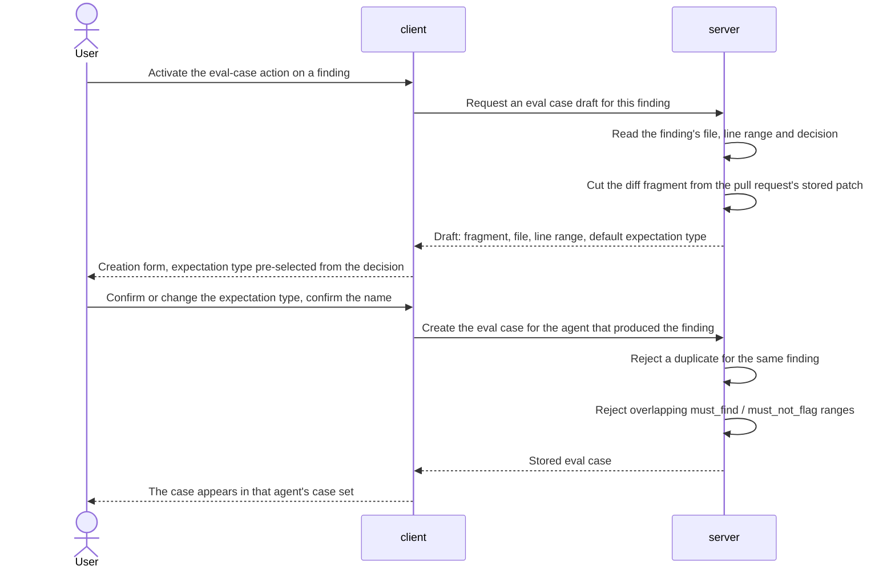
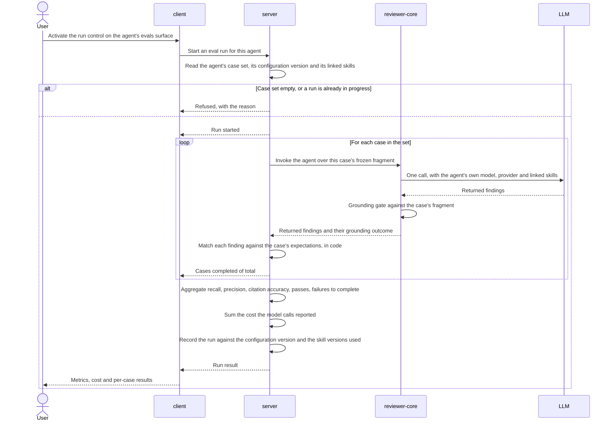
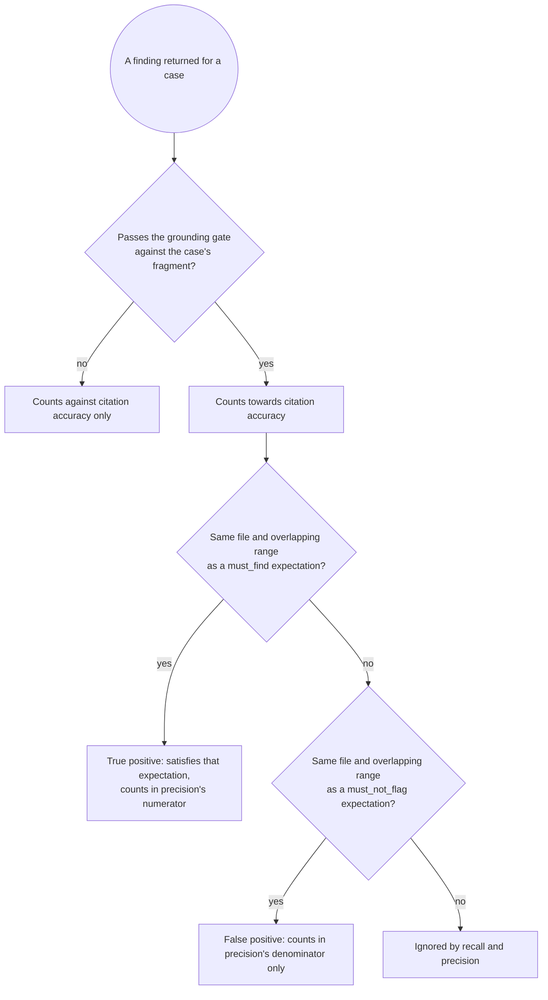

# SPEC-03: Eval Pipeline

Status: approved
Modules: client, server, reviewer-core
Supersedes: —
Superseded by: SPEC-04
Design refs: `docs/specs/cross/_design/SPEC-03-eval-pipeline/01-turn-into-eval-case.png`,
`02-agent-evals-tab.png`, `03-eval-case-modal.png`, `04-eval-dashboard.png`,
`05-eval-dashboard-agent.png`, `06-compare-runs.png`

## Problem & why

Changing a review agent — its system prompt, its model, the skills linked to it
— is currently an act of faith. The only evidence that the change helped is the
next review the user happens to read, on a pull request they have not seen
before, against no baseline. Nothing tells them that a prompt edit that made one
finding sharper also made the agent start flagging things it used to leave
alone.

The material for a regression harness already exists and has already been paid
for. Every accept and every dismiss the user has recorded on a real finding is a
label: accepted means the agent was right to speak, dismissed means it was not.
The workspace already holds 25 accepted and 6 dismissed findings for a single
agent across five pull requests. What is missing is the machinery that turns
those decisions into a fixed case set, replays an agent over it, and reports the
result as numbers that two runs can be compared on.

Two properties make this worth specifying rather than prototyping. First, the
scoring must be mechanical: an expectation here is a file and a line range, and
whether an agent hit it is a question code can answer, so no model is involved
in judging a run and no run can drift because a judge drifted. Second, the
inputs must be frozen: if the agent under evaluation could read the repository,
two runs weeks apart would not be measuring the same thing, and the comparison
that the whole feature exists for would be meaningless.

The first case set is expected to hold at least eight cases, which the existing
labelled findings comfortably support.

## Goals / Non-goals

**Goals**

- Turn a finding the user has already judged into a labelled eval case from the
  finding itself, without leaving the review.
- Support both directions of the label: the agent must report a problem at a
  place, and the agent must stay silent at a place.
- Freeze each case's input at creation, so that runs made weeks and several
  agent versions apart measure the same thing.
- Run an agent over its whole case set in one action, replaying the agent as it
  is actually configured — its own model, its own provider and its own linked
  skills.
- Score every run in code, with no model call anywhere on the scoring path, and
  report recall, precision and citation accuracy under definitions pinned in
  this document.
- Keep every run as history, recording which agent configuration produced it.
- Record and present what a run cost as a second axis next to quality, so that a
  recall bought by spending more is visible as exactly that — never folded into
  a metric, never scored.
- Let the user put two runs of one agent side by side and see the metric
  differences together with the configuration difference that caused them.
- Show recent runs across all agents in one place reachable from the workspace
  navigation.

**Non-goals** — visible in the mockups, deliberately not built here:

- **Promoting a configuration from the comparison.** The `Promote v7` control in
  mockup 6 is not rendered. Comparing runs never changes an agent.
- **The metric trend chart** (mockup 5) and the per-agent sparklines (mockup 4).
- **The automatic alert banner** ("Precision dipped 2pts on v7 …", mockup 5). No
  interpretation of a metric movement is generated.
- **The 30-day range filter** (mockup 5) and any other run-history filtering.
- **`Run all agents`** (mockup 4). A run always covers exactly one agent.
- **Running a single case.** The per-row run control in mockup 2 and the
  `Run case` control in mockup 3 are not rendered. A run covers the whole case
  set, because a metric over an arbitrary subset is not comparable to anything.
- **`Run on save`** (mockup 3).
- **The `Files` and `PR meta` input tabs** of the case editor (mockup 3). A case
  carries one diff fragment and nothing else.
- **Authoring a case from scratch.** The `New eval case` control in mockup 2 is
  not rendered; a case can only be born from a finding, which is what makes the
  case set a record of real decisions rather than of imagined ones.
- **A free-form expected-output document.** Mockup 3 shows the expectation as
  editable JSON with a severity, a category and a title. The expectation in this
  feature is a file path, a line range and one of two types; severity, category
  and title are never compared, and no JSON expectation is authored or
  validated.
- **Per-run token counts and latency.** A run records and presents what it cost
  in money; how many tokens it consumed and how long it took are not recorded
  and not rendered.
- **Repeated trials of one configuration.** A run executes each case once; no
  `pass@k` or `pass^k` aggregate exists.
- **Any model-judged criterion** — explanation quality, severity correctness,
  semantic equivalence. Only file-and-range matching is scored.
- **Comparing runs of two different agents**, whose case sets are different sets
  of cases and whose metrics are therefore not comparable.
- **Blocking anything on a metric.** No run result gates a review, a merge or a
  CI job.
- **Changing how reviews, findings, decisions or the grounding gate work.** This
  feature reads them and changes none of them.

## User stories

- **US-1** As a reviewer who has just accepted a finding, I want to turn it into
  an eval case from the finding itself, so that building the dataset costs me
  one click on work I was doing anyway.
- **US-2** As a reviewer who has just dismissed a finding, I want to record that
  the agent should have stayed silent there, so that the dataset punishes noise
  and not only misses.
- **US-3** As the author of the dataset, I want to choose the expectation type
  myself, so that a dismissal I made for a reason other than "no problem here"
  does not silently become a wrong label.
- **US-4** As an agent author, I want to see every case in an agent's set and
  every run it has had in one place, so that I know what the agent is being held
  to.
- **US-5** As an agent author, I want to run the agent over the whole set in one
  action, so that a configuration change can be measured immediately after I
  make it.
- **US-6** As an agent author, I want recall, precision and citation accuracy
  defined by rules I can read, so that I can tell whether a number moved because
  the agent changed or because the scoring did.
- **US-7** As an agent author who has edited a system prompt, changed a model or
  edited a linked skill, I want to put the run before the change next to the run
  after it, so that "old configuration vs new" is a measurement rather than an
  impression.
- **US-8** As an agent author, I want to know when two runs I am comparing did
  not cover the same cases, so that I do not read a case-set change as a quality
  change.
- **US-9** As someone responsible for the workspace, I want the model to play no
  part in scoring, so that the numbers are reproducible and cost nothing to
  recompute.
- **US-10** As someone watching several agents, I want one page listing the most
  recent runs across all of them, so that I can see which agent was last
  measured and when.
- **US-11** As an agent author comparing two configurations, I want to see what
  each run cost next to what it scored, so that I can tell a genuine improvement
  from one I bought with a more expensive model.
- **US-12** As an agent author, I want a run to replay the agent with the skills
  it actually links, and to say so when two runs did not link the same ones, so
  that a skill edit is something I can measure rather than something I am
  measured against without knowing.

## Workflow & module interaction

Turning a finding into an eval case:

Running a case set and scoring it:

How one returned finding is classified — no model call on any branch:

## Contracts (shape only)

**Eval case** — belongs to exactly one agent: the agent that produced the
finding it was born from. It carries a name, the identity of that finding, a
diff fragment copied at creation, and one or more expectations. The fragment is
captured once and is never editable; editing a case can change its name and its
expectations only. A case created from a finding carries exactly one
expectation.

**Expectation** — carries a type, a file path and a line range. The type is one
of exactly two: *must_find* (the agent is expected to report a problem there)
and *must_not_flag* (the agent is expected to stay silent there). Within one
case, no *must_not_flag* range may overlap a *must_find* range on the same file;
a single returned finding cannot be both a hit and a false positive.

**Diff fragment** — a copy of the whole of each hunk of the finding's file that
intersects the finding's line range, taken from the pull request's stored
per-file patch, together with the context lines that patch already carries
around those hunks, and no other file content. It is the only code the agent
under evaluation sees when that case is run. It never changes: re-importing the
pull request, re-running the review, re-deciding the finding or deleting it
leave the fragment as it was.

**Eval run** — covers one agent and every case in that agent's set at the moment
the run started. It carries the identity of the agent configuration version it
invoked, the identity and version of each skill it invoked, a start time, a
completion state, a per-case result for each case it covered, the three metrics,
the total cost of the model calls it made, the number of cases that passed, the
total number of cases it covered, and the number of cases whose invocation did
not complete. A run is never rewritten after it completes.

**Invoked configuration** — everything about the agent that shapes what the
model sees: the model, the provider, the system prompt and the linked skills, in
the order the agent links them. The whole of it is replayed on every case,
because a run whose invocation drops part of the agent's configuration measures
an agent the user never ships. The agent's own version identity does not cover
all of it: a skill's body can be edited, or re-imported from elsewhere, without
the agent's configuration version moving at all, so a run records the version of
each skill it invoked separately from the agent's own version. Those two
recordings together are what make two runs comparable. Their reach has one known
limit, stated here so it is never mistaken for a gap: a skill's recorded version
tracks that skill's **body**, so AC-38 and AC-39 catch a rewritten or re-imported
body and a changed set of linked skills, but not a skill that was only renamed or
only enabled and disabled. A metric that moves across such a change is therefore
unexplained by the comparison, and this blind spot — not noise — is the first
thing to suspect when it does.

**Per-case result** — carries the case's identity, whether the invocation
completed, the findings the agent returned for that case as returned (each with
its file path, its line range and whether it passed the grounding gate), and
whether the case passed. A case passes when every *must_find* expectation of
that case was matched by at least one returned finding and no returned finding
for that case matched a *must_not_flag* expectation.

**Match** — a returned finding matches an expectation when the file paths are
equal and the line ranges overlap. Nothing else is compared: not the title, not
the severity, not the category, not the wording. Two different problems on the
same line are one match; the same problem after a line shift is not. This is a
known limit of the rule, accepted here and stated so that a number is never read
as more than it is.

**Recall** — the share of *must_find* expectations, across all cases the run
scored, that were matched by at least one returned finding.

**Precision** — among the returned findings that matched either a *must_find*
expectation or a *must_not_flag* expectation, the share that matched a
*must_find* expectation. **A returned finding that matches no expectation at all
is ignored by precision**, in the numerator and in the denominator alike: the
case set labels specific places, and silence about everywhere else is not
evidence of noise.

**Citation accuracy** — the share of all findings returned in the run that pass
the grounding gate against the fragment of the case they were returned for. It
measures citation validity and nothing else: a finding that cites a real line in
the fragment counts here even if the problem it describes is imaginary, and a
missed problem does not affect it at all.

**Metric denominators** — a run whose scored cases contain no *must_find*
expectation has no recall; a run in which no returned finding matched any
expectation has no precision; a run in which the agent returned no finding at
all has no citation accuracy. An absent metric is a distinct state from a metric
whose value is zero.

**Run cost** — the total cost of the model calls a run made, summed from the
cost each call already reports. **Cost is not a metric and is never scored**: it
does not enter recall, precision, citation accuracy or a case's pass state, no
run passes or fails because of it, and nothing is gated on it. It is a second
axis reported next to quality, so that a configuration which bought a better
recall by spending more is visible as exactly that rather than folded into a
single number. A run whose cost cannot be determined has no cost, which is a
distinct state from a cost of zero.

**Run comparison** — two runs of the same agent, presented together with, for
each metric, the value in the earlier run, the value in the later run and the
difference between them; the same three values for the run cost; the difference
between the system prompts of the two agent configuration versions the runs
recorded; when the two runs invoked different skills or different versions of
the same skill, a statement that they did; and, when the two runs did not cover
the same set of cases, a statement that they did not. The last two exist for one
reason: a metric that moved must never be attributed to the only difference the
screen happens to show.

## Acceptance criteria (EARS)

**Reaching the surfaces**

- **AC-1** WHEN the user selects the evals section of an agent's editor, the
  system SHALL present that agent's eval case set and that agent's eval run
  history.
- **AC-2** WHEN the user selects the eval dashboard entry in the workspace
  navigation, the system SHALL present the most recently completed eval runs
  across all agents, newest first.
- **AC-3** WHEN the user selects an agent on the eval dashboard, the system
  SHALL present that agent's eval run history.
- **AC-4** IF an agent has no completed eval run, THEN the system SHALL state
  that no run has happened for that agent and SHALL NOT present a recall, a
  precision or a citation accuracy for it.

**Turning a finding into an eval case**

- **AC-5** WHEN the user activates the eval-case action on a finding, the system
  SHALL present an eval case creation form carrying that finding's file path,
  its line range and the diff fragment captured for it.
- **AC-6** WHEN the eval case creation form is presented, the system SHALL
  pre-select the expectation type that corresponds to the finding's decision:
  *must_find* for a finding the user has accepted, *must_not_flag* for a finding
  the user has dismissed, and no type for a finding the user has neither
  accepted nor dismissed.
- **AC-7** The system SHALL NOT create an eval case whose expectation type the
  user has not confirmed on the creation form.
- **AC-8** WHEN the user confirms the eval case creation form, the system SHALL
  create an eval case belonging to the agent that produced the finding, carrying
  the confirmed expectation type, the finding's file path, the finding's line
  range and the captured diff fragment.
- **AC-9** A stored eval case's diff fragment, file path, line range and
  expectation type SHALL NOT change when the finding, the review or the pull
  request it was created from changes.
- **AC-10** IF an eval case already exists for a finding, THEN the system SHALL
  present that existing eval case and SHALL NOT create a second eval case for
  the same finding.

**Keeping the case set consistent**

- **AC-11** IF storing an eval case would leave a *must_not_flag* range
  overlapping a *must_find* range on the same file within that case, THEN the
  system SHALL NOT store that eval case and SHALL state which two ranges
  overlap.
- **AC-12** WHEN an eval case is edited or deleted, the system SHALL leave the
  metrics and the per-case results already recorded by completed eval runs
  unchanged.
- **AC-13** IF an agent has no eval cases, THEN the system SHALL state that its
  eval case set is empty and SHALL NOT start an eval run for that agent.

**Running a case set**

- **AC-14** WHEN the user activates the run control for an agent's eval case
  set, the system SHALL start exactly one eval run covering every eval case in
  that set at that moment.
- **AC-15** WHILE an eval run is in progress, the system SHALL present the
  number of that run's cases completed out of its total case count and SHALL NOT
  present a recall, a precision or a citation accuracy for that run.
- **AC-16** WHILE an eval run for an agent is in progress, the system SHALL NOT
  start another eval run for that agent.
- **AC-17** For each eval case in a run, the system SHALL invoke the agent under
  evaluation over that case's stored diff fragment and SHALL NOT give that
  invocation access to any other content of the repository the case came from.
- **AC-18** The system SHALL invoke the agent under evaluation with the model,
  the provider and the linked skills recorded in that agent's own configuration.
- **AC-19** An eval run SHALL record the identity of the agent configuration
  version it invoked.
- **AC-38** An eval run SHALL record, for each skill it invoked, that skill's
  identity together with the version of that skill it invoked.
- **AC-20** IF the invocation for an eval case does not complete, THEN the system
  SHALL carry on invoking the remaining cases of that run.
- **AC-21** An eval run SHALL exclude every case whose invocation did not
  complete from its recall, its precision and its citation accuracy.
- **AC-22** An eval run SHALL state the number of its cases whose invocation did
  not complete.

**Scoring, in code only**

- **AC-23** A returned finding SHALL count as matching an expectation when its
  file path is equal to that expectation's file path and its line range overlaps
  that expectation's line range.
- **AC-24** An eval run's recall SHALL be the share of the *must_find*
  expectations it scored that were matched by at least one finding returned for
  their case.
- **AC-25** An eval run's precision SHALL be the share of returned findings that
  matched a *must_find* expectation, taken among the returned findings that
  matched either a *must_find* expectation or a *must_not_flag* expectation.
- **AC-26** An eval run's citation accuracy SHALL be the share of the findings it
  scored that pass the grounding gate against the diff fragment of the case they
  were returned for.
- **AC-27** IF a metric's denominator is zero for an eval run, THEN the system
  SHALL present that metric as unavailable and SHALL NOT present it as zero.
- **AC-28** An eval case SHALL count as passed in an eval run when every
  *must_find* expectation of that case was matched by at least one finding
  returned for it and no finding returned for it matched a *must_not_flag*
  expectation of that case.
- **AC-29** Scoring an eval run SHALL perform zero model calls.

**Comparing two runs**

- **AC-30** WHILE the number of selected eval runs is not exactly two, the system
  SHALL NOT permit an eval run comparison to be opened.
- **AC-31** WHEN the user opens a comparison of two selected eval runs, the
  system SHALL present, for each metric, its value in each of the two runs and
  the difference between them.
- **AC-32** An eval run comparison SHALL present the difference between the
  system prompts of the two agent configuration versions the compared runs
  recorded.
- **AC-33** IF the two compared eval runs did not cover the same set of eval
  cases, THEN the system SHALL state that the two runs cover different case sets.
- **AC-39** IF the two compared eval runs invoked different skills, or different
  versions of the same skill, THEN the system SHALL state that the two runs
  invoked different skills.

**Reporting what a run cost**

- **AC-34** An eval run SHALL record the total cost of the model calls it made.
- **AC-35** The eval run history SHALL present each run's total model-call cost
  alongside that run's recall, precision and citation accuracy.
- **AC-36** An eval run comparison SHALL present the total model-call cost of
  each of the two compared runs and the difference between them.
- **AC-37** IF an eval run's total model-call cost cannot be determined, THEN
  the system SHALL present that cost as unavailable and SHALL NOT present it as
  zero.

## Edge cases

- **A finding with no decision yet.** Convertible, with no expectation type
  pre-selected (AC-6) and no case created until the user picks one (AC-7). This
  is the deliberate consequence of treating a decision as a *default*, not as
  the truth: a dismissal often means "not worth reporting here", which is not
  the same as "the agent should be silent here".
- **The same finding converted twice.** The existing case is presented instead
  (AC-10). Two cases from one finding would double that label's weight in every
  metric.
- **Two findings on overlapping lines of the same file, one accepted and one
  dismissed.** Each becomes its own case with its own fragment, and AC-11 does
  not apply across cases. Within case A, a finding at case B's range matches no
  expectation of case A and is ignored (Contracts, **Precision**).
- **A case whose only expectation is `must_not_flag`.** It contributes nothing
  to recall, passes when the agent returns nothing that overlaps its range, and
  is the case shown as "expected 0 findings" in mockup 2.
- **An agent whose whole set is `must_not_flag`.** The run has no recall at all
  (AC-27), not a recall of zero — an agent that correctly stays silent
  everywhere has not failed to find anything.
- **A run in which the agent returns nothing.** Recall is zero if the set holds
  any *must_find* expectation; precision and citation accuracy are unavailable
  (AC-27).
- **A returned finding that fails the grounding gate.** It lowers citation
  accuracy (AC-26) and cannot match any expectation, because an expectation's
  range lies inside the fragment and any range overlapping it necessarily
  intersects the fragment too. The two rules therefore never disagree.
- **A returned finding outside every labelled range.** Ignored by recall and
  precision, still counted by citation accuracy. This is the single most
  load-bearing scoring decision in the feature: the case set labels places, and
  it is not a claim that everything else is clean.
- **A case whose invocation fails mid-run.** The run continues (AC-20), the case
  is excluded from every metric (AC-21), and the count of such cases is stated
  (AC-22). Excluding it silently would let an infrastructure failure raise
  recall.
- **Every case failing to complete.** All three metrics are unavailable (AC-27)
  and the run states that every case failed (AC-22). Such a run still appears in
  the history, because a run that vanished would be indistinguishable from one
  that was never started.
- **A run that cost money and produced no metrics.** Cost and quality are
  independent axes: a run whose cases all failed to complete still records
  whatever its attempted calls cost (AC-34), and that cost is presented next to
  three unavailable metrics (AC-27, AC-35). A cost that the model calls did not
  report is presented as unavailable, never as zero (AC-37) — a free run and an
  unmeasured one must not look alike.
- **A case added while a run is in progress.** The run covers the set as it was
  when it started (AC-14); the new case first appears in the next run, and the
  two runs then cover different sets (AC-33).
- **A case edited or deleted after runs exist.** Recorded results are untouched
  (AC-12). A comparison spanning the change states that the case sets differ
  (AC-33) rather than presenting the metric difference as a quality difference.
- **A case whose diff fragment cannot be cut** — the pull request holds no patch
  for the finding's file, or the finding's range lies outside every hunk. No
  case is created and the reason is stated. The case set must never contain a
  case with no input, because such a case would fail on every run for reasons
  that have nothing to do with the agent.
- **A finding that predates this feature.** Every existing finding is
  convertible: the file path, the line range and the accept/dismiss decision it
  already carries are exactly the inputs AC-5 and AC-6 need, and the pull
  request's stored patches are already there. No finding is migrated, and a
  finding with no case is the ordinary state.
- **An agent configuration version that predates this feature.** A run records
  whichever version was current when it started (AC-19); versions created before
  this feature existed are recorded the same way as any other.
- **A run recorded against a configuration version or a skill version that no
  longer exists.** The run keeps its metrics and its per-case results; the
  comparison states that the prompt difference cannot be shown rather than
  showing an empty difference, and the skills the two runs invoked are still
  compared by identity and version (AC-39), which is what a deletion changes.
- **A skill edited, unlinked or re-imported between two runs.** The agent's own
  configuration version can be unchanged across such an edit, so AC-19 alone
  would show two runs as identically configured. AC-38 and AC-39 are what keep
  the difference visible — without them, a recall drop caused by a rewritten
  skill is read as noise, or worse, blamed on a prompt diff that shows nothing.
- **The eval dashboard before any run in the workspace.** It states that no run
  has happened yet and lists nothing. An empty list with no statement is
  indistinguishable from a list that failed to load.
- **Two runs of different agents selected.** Not comparable and not offered:
  selection for comparison is confined to one agent's run history (AC-3, AC-30).
- **A very large case set.** A run invokes the agent once per case, so its
  duration and cost grow linearly with the set; the progress readout (AC-15) is
  what makes a long run distinguishable from a stuck one.
- **A case whose fragment is very long.** Presented in full and scrollable; no
  truncation rule is defined, because a truncated fragment would silently change
  what the agent under evaluation sees.
- **The user leaves the surface while a run is in progress.** The run continues;
  returning to the run history shows either the progress (AC-15) or the finished
  result. A run is not bound to the surface that started it.

## Non-functional requirements

- An eval run SHALL perform exactly one model call per eval case it invokes, and
  no model call on any other path — not on scoring, not on reading a run's
  history, not on opening a comparison.
- A run therefore costs one model call per case, and AC-16 is what bounds how
  much of that can be in flight at once: one run per agent, never two. No
  per-minute cap is specified.
- Eval cases and eval runs SHALL be created and read only within the requesting
  user's workspace, on every path including the paths that read history and
  build a comparison.
- Every control in the eval case list, the run history and the comparison SHALL
  have an accessible name identifying both its action and the case or run it
  acts on — including the icon-only edit and delete controls of a case row.
- A run's selection control SHALL have an accessible name identifying that run
  by its start time and by the agent configuration version it recorded, so that
  rows differing only by position are distinguishable.
- Every control on the evals surface, the eval dashboard and the comparison
  SHALL be operable using the keyboard alone.
- WHILE the run comparison is open, keyboard focus SHALL remain within it.
- WHEN the run comparison closes, the system SHALL move keyboard focus to the
  control that opened it.
- A metric's value, a run's cost, and the direction in which either changed
  between two compared runs SHALL be conveyed by text, and SHALL NOT be conveyed
  by colour or by bar length alone.
- A case's passed or failed state in a run SHALL be conveyed by text, and SHALL
  NOT be conveyed by icon or colour alone.
- WHEN an eval run completes, the system SHALL announce its completion without
  moving keyboard focus.
- Progress during an eval run SHALL be announced at most once per completed
  case, so that a long run does not produce a continuous stream of
  announcements.
- Text and non-decorative indicators on the evals surface, the eval dashboard
  and the comparison SHALL meet a contrast ratio of at least 4.5:1 against their
  background.
- Interactive targets in case rows and run rows, including selection controls,
  SHALL be at least 24×24 CSS pixels.

## Inputs and provenance

| Input | Provenance |
|---|---|
| A finding's file path and line range | `[reused: the existing finding]` |
| A finding's accept/dismiss decision, used only as the default expectation type | `[reused: existing finding decisions]` |
| The case's diff fragment | `[deterministic: cut from the pull request's stored per-file patch, no network call]` |
| The confirmed expectation type | `[deterministic: chosen by the user on the creation form]` |
| The agent's model, provider, system prompt and linked skills | `[reused: the agent's stored configuration version and the stored bodies of the skills it links]` |
| The identity of the configuration version and of each skill version a run used | `[reused: the agent's existing version history and the skills' existing version history]` |
| Findings returned for a case | `[new: 1 LLM call per eval case in the run]` |
| Grounding outcome of each returned finding | `[deterministic: the existing grounding gate, no model call]` |
| Whether a returned finding matches an expectation | `[deterministic: file equality and range overlap, no model call]` |
| Recall, precision, citation accuracy, passed count, failed-to-complete count | `[deterministic: aggregation in code, no model call]` |
| The total cost of a run | `[deterministic: summed from the model calls the run made, no extra model call]` |
| The system prompt difference between two runs | `[deterministic: the two recorded configuration versions, no model call]` |

Total per run: **one model call per eval case, and nothing else**. Total for
creating a case, scoring a run, reading a run history and opening a comparison:
**0 model calls**.

## Untrusted inputs

Foreign text this feature reads:

- **The diff fragment.** Repository source, authored by whoever wrote the pull
  request, frozen into the case and replayed into a model prompt on every run.
  It is the primary injection surface, and unlike a live review it is replayed
  repeatedly and deliberately.
- **Findings returned by the agent under evaluation.** Model output derived from
  that fragment, carrying a title, an explanation, a file path and a line range,
  all of which are stored in the run's per-case result and rendered back to the
  user.
- **The finding text, file path and pull request metadata** captured into a case
  at creation and shown in the case list.
- **The agent's system prompt**, rendered in the comparison as a difference
  between two versions.
- **The linked skills' bodies.** Workspace-authored, but a skill can be imported
  from an external repository, so its text is not always something anyone here
  wrote.
- **The case name**, free text the user may edit.

Handling:

- The diff fragment enters the agent's prompt as **data**, inside the same
  delimited untrusted block a normal review uses, and never merged into any
  instruction section. A fragment containing text formatted as an instruction
  leaves the prompt's instruction sections identical to those of a run over a
  benign fragment.
- **A linked skill's body is not treated as foreign text on this path, and is
  never placed inside the untrusted block.** It occupies the instruction section
  of the prompt, exactly as it does in an ordinary review: a skill *is*
  instructions, deliberately, and wrapping it as inert data would neuter the
  very thing the run is measuring. It therefore must never be merged into the
  same delimited region as the diff fragment — the fragment is data the agent
  reasons about, the skill is part of the agent doing the reasoning, and the
  boundary between them is what makes a run's result attributable. The
  compensating control is visibility, not quarantine: a run records the version
  of every skill it invoked (AC-38), and a comparison says so when two runs
  invoked different skills or different versions (AC-39), so a body that changed
  — including one that changed because it was re-imported from elsewhere —
  cannot move a metric without leaving a trace on the screen that explains it.
- A skill body is rendered as inert text wherever the comparison shows it, on
  the same terms as the system prompt.
- Nothing a returned finding says is trusted about what exists: its file path
  and line range are checked against the case's own fragment by the grounding
  gate before they count towards citation accuracy, and matching compares them
  only against the expectations of that same case.
- A returned finding can never cause anything to be read outside the case's
  fragment; the invocation has no repository access at all (AC-17).
- Findings, fragments, case names and system prompt text are presented as inert
  content: no active content, no automatic requests to addresses named in the
  text.
- A case name and a fragment are rendered as text, never as markup, on every
  surface that lists them.
- Case creation, running, history and comparison are workspace-scoped on every
  path, including the read-only ones.

## Traceability

| AC | Verified by |
|---|---|
| AC-1 | e2e flow |
| AC-2 | e2e flow |
| AC-3 | e2e flow |
| AC-4 | unit |
| AC-5 | server integration |
| AC-6 | unit |
| AC-7 | unit |
| AC-8 | server integration |
| AC-9 | server integration |
| AC-10 | server integration |
| AC-11 | server integration |
| AC-12 | server integration |
| AC-13 | server integration |
| AC-14 | server integration |
| AC-15 | unit |
| AC-16 | server integration |
| AC-17 | unit |
| AC-18 | unit |
| AC-19 | server integration |
| AC-20 | unit |
| AC-21 | unit |
| AC-22 | unit |
| AC-23 | unit |
| AC-24 | unit |
| AC-25 | unit |
| AC-26 | unit |
| AC-27 | unit |
| AC-28 | unit |
| AC-29 | unit |
| AC-30 | unit |
| AC-31 | e2e flow |
| AC-32 | unit |
| AC-33 | unit |
| AC-34 | server integration |
| AC-35 | unit |
| AC-36 | unit |
| AC-37 | unit |
| AC-38 | server integration |
| AC-39 | unit |

## Open questions

None. Every question raised while drafting has been decided. The decisions are
recorded where they bind and are listed here only so a later reader does not
have to rediscover that the alternatives were considered.

| Decision | Where it binds |
|---|---|
| A case's fragment is the whole of each hunk intersecting the finding's range, plus the context lines the stored patch already carries, and no other file content | Contracts (**Diff fragment**), AC-5, AC-8 |
| A case may hold more than one expectation; creation from a finding always produces exactly one, and editing is the only way to add another | Contracts (**Eval case**), AC-8, AC-11 |
| The fragment is captured once and is never editable; editing changes a case's name and expectations only | Contracts (**Eval case**), AC-9 |
| No per-minute cap on starting runs. One run per agent at a time (AC-16) is the only concurrency bound, and a run costs one model call per case | Non-functional requirements, AC-16 |
| A run whose cases all failed to complete stays in the history, is selectable for comparison, and presents every metric as unavailable | AC-21, AC-22, AC-27, Edge cases |
| Findings outside every labelled range are ignored by recall and precision, in numerator and denominator alike | Contracts (**Precision**), AC-25, Edge cases |
| An absent metric or an absent cost is a distinct state from a value of zero | Contracts (**Metric denominators**), AC-27, AC-37 |
| Cost is recorded and presented as a second axis, and is never scored, never part of a pass state, and never gated on; token counts and latency are recorded nowhere | Non-goals, Contracts (**Run cost**), AC-34, AC-35, AC-36 |
| A run covers the case set as it was when the run started | AC-14, AC-33, Edge cases |
| A run replays the whole invoked configuration, linked skills included; a skill body is instructions and stays in the prompt's instruction section, never inside the untrusted block with the diff fragment | Goals, Contracts (**Invoked configuration**), AC-18, Untrusted inputs |
| A skill version is recorded separately from the agent's configuration version, because a skill body can change without that version moving | Contracts (**Invoked configuration**), AC-38, AC-39, Edge cases |
| The finding's decision is a default, not the label; the user confirms the expectation type | AC-6, AC-7 |
