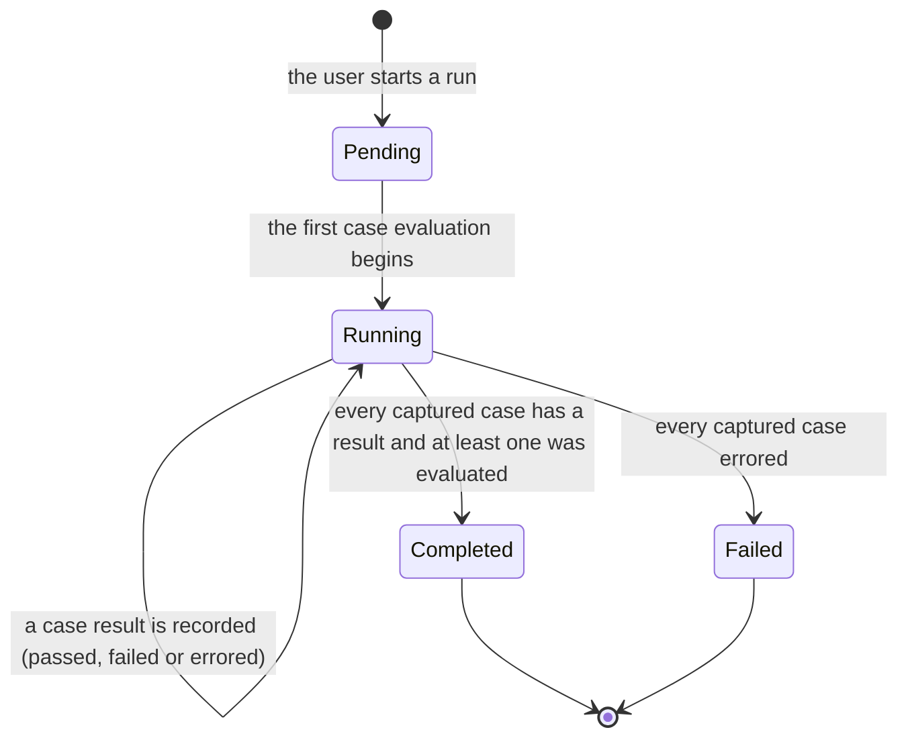
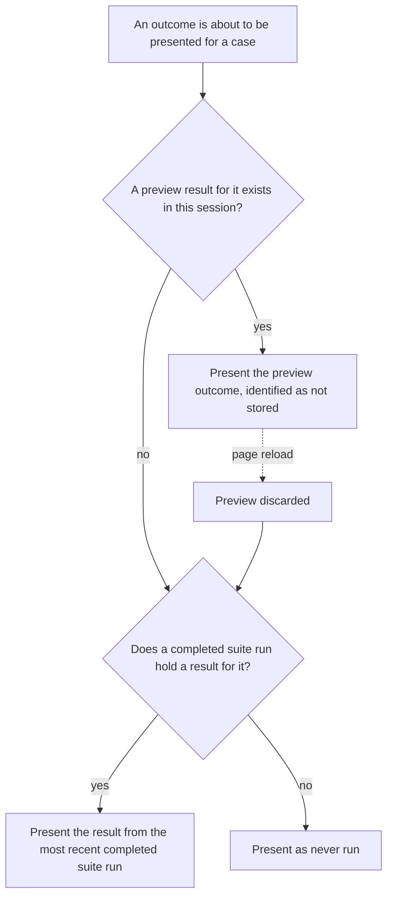

# SPEC-03: Eval Pipeline

Status: approved
Modules: client, server, reviewer-core
Supersedes: —
Superseded by: —
Design refs:
`docs/specs/cross/_design/SPEC-03-eval-pipeline/01-finding-turn-into-eval-case.png`,
`02-eval-dashboard-all-agents.png`,
`03-eval-dashboard-agent-detail.png`,
`04-eval-compare-runs-modal.png`,
`05-agent-editor-evals-tab.png`,
`06-eval-case-positive.png`,
`07-eval-case-negative.png`

## Problem & why

Changing a reviewer agent's system prompt, model or linked skills today is an
unmeasured act. The only feedback is the next review the user happens to read,
on a different pull request, with a different diff — so a prompt edit that
quietly stops catching hardcoded secrets, or starts flagging every unused
import, is invisible until someone notices by accident.

The dataset needed to measure it already exists and was produced as a
by-product of ordinary use: every finding a user accepted is a statement that
the agent was right, and every finding a user dismissed is a statement that it
was wrong. What is missing is the machinery that turns those decisions into
frozen, repeatable test cases, runs the agent against them, and reports whether
a change moved recall, precision and citation accuracy up or down.

Two properties make this worth specifying rather than prompting for. First,
**scoring must not involve a model** — an eval whose judge is itself a model
inherits the judge's variance and cannot be a regression signal. Scoring here is
mechanical **content-trigger**: a positive case passes when the agent produces at
least one grounded finding on the frozen input; a negative case passes when it
produces none. Expectation file/line fields are provenance for the UI, not a
match key. Second, **a case must be reproducible** — its input is a frozen diff
plus the agent's system prompt, model, strategy and linked skills, so a run six
weeks later measures the agent configuration, not the state of a pull request or
of the repository index. Project-context attachments are intentionally excluded
from eval invocation (content-only, like the harness `evals/` quality tier).

## Goals / Non-goals

**Goals**

- Turn a finding that the user has already accepted or dismissed into a stored
  eval case in one action, with the expectation's polarity chosen from that
  decision.
- Let a user create, edit and delete an agent's eval cases by hand, and support
  building up an eval set of arbitrary size this way.
- Run an agent over its whole eval set as a background job, score every case
  mechanically, and store the run with its aggregate metrics.
- Evaluate the agent **as configured for content-only eval** — its system
  prompt, model, review strategy and linked skills — over the case's frozen
  diff, without project-context attachments, so a run measures the agent's
  authored behaviour on a self-contained snippet.
- Capture, with each run, that project context was not resolved (empty captured
  context), so comparisons stay honest about what entered the prompt.
- Run a single case as a throwaway preview that is never stored.
- Present, per agent, the metrics of the most recent completed run and their
  movement against the run before it.
- Present the history of completed runs and let two of them be compared,
  including the difference between the system prompts they captured.
- Present a workspace-wide view of every agent that has an eval set.

**Non-goals** — explicitly not part of this feature:

- **Anything derived from a live pull request or a live repository index.**
  Repo-intel enrichment (callers digest, repo map, file-rank note), the pull
  request description and body, and the derived PR intent are all excluded from
  an eval invocation. None of them is resolvable from a frozen diff with no pull
  request behind it and no current index, and including any of them would make a
  run non-reproducible. Project-context attachments are **also** excluded from
  eval invocation: cases are content-only fixtures (frozen diff + agent prompt /
  skills), so attachment text read from a live working copy cannot change a
  score.
- **Any model call inside scoring.** No model judges a case, an expectation, a
  match or a metric — ever, on any path. A semantic practices judge (as in the
  harness `evals/` package) is out of scope; content-trigger polarity is the
  deterministic stand-in.
- **Agent version labels.** A run is identified by its own identity and the time
  it started. The `v6`/`v7` labels visible in mockups 2, 3 and 4 are not
  rendered anywhere, and nothing in this feature reads or produces them.
- **Zone-overlap matching as a pass key.** Expectation file and line intervals
  are provenance (seeded from a finding) and may be shown in the UI; they do not
  decide pass or fail.
- **Eval cases owned by anything other than an agent.** No workspace-level,
  skill-level or repository-level eval sets.
- Mockup elements deliberately not built: the **Learn** and **Reply to author**
  finding actions (mockup 1); **sparklines** and the **metric trend** chart
  (mockups 2, 3); the **alert banner** on the agent dashboard (mockup 3); the
  **Promote** button in the compare modal (mockup 4); the **Run on save** toggle
  and the **+ Finding skeleton** button in the case dialog (mockups 6, 7); the
  **Files** and **PR meta** input tabs in the case dialog (mockups 6, 7).
- **A required eval-set size.** The capability must support an eval set of any
  size; no criterion here demands that a particular number of cases exists in
  any particular database.
- Changing how findings are produced, grounded, accepted or dismissed. This
  feature reads those and changes none of them.

## User stories

- **US-1** As a user who has just accepted a finding, I want to turn it into an
  eval case in one action, so that building a regression set costs nothing
  beyond the reviewing I was already doing.
- **US-2** As a user who has just dismissed a finding, I want the resulting case
  to assert that the agent must *not* flag that place again, so that false
  positives are measured, not only misses.
- **US-3** As an agent author, I want to see every case in the agent's set with
  its last outcome, so that I know what the agent is currently being held to.
- **US-4** As an agent author, I want to try one case immediately while editing
  it, without polluting the history I use to judge regressions.
- **US-5** As an agent author, I want to run the whole set after a prompt change
  and see recall, precision and citation accuracy move, so that "better" is a
  number rather than an impression.
- **US-6** As an agent author, I want the run to happen in the background and
  tell me when it is done, so that a set of a dozen cases does not freeze the
  interface for minutes.
- **US-7** As an agent author, I want to compare two runs side by side with the
  difference between their system prompts, so that I can attribute a metric
  change to the edit that caused it.
- **US-8** As someone responsible for the workspace, I want one view of every
  agent's current standing, so that I can see which agent regressed without
  opening each one.
- **US-9** As a user, I want a case whose evaluation failed to be visible as a
  failure of the machinery rather than silently improving the metrics, so that a
  broken run cannot be mistaken for a good one.

## Workflow & module interaction

A suite run, from the control to the finished metrics. Context is resolved
**per case**, not once per run, because an attachment belongs to a repository and
each case names its own repository (AC-46, AC-47); a set whose cases come from
two repositories therefore assembles different documents for different cases.

```mermaid
sequenceDiagram
  actor User
  participant Client as client
  participant Server as server
  participant Core as reviewer-core
  participant LLM

  User->>Client: Start a suite run for an agent
  Client->>Server: Request a suite run
  Server->>Server: Capture the agent's system prompt, model, review strategy and linked skills
  Server->>Server: Capture the agent's case set as it is now
  Server-->>Client: Run identity, state pending
  Client-->>User: Run in progress; last completed run's metrics still presented
  loop One captured case at a time
    Server->>Server: Resolve the agent's context attachments for the case's repository
    Server->>Server: Read each resolved document from the working copy; record any it cannot read
    Server->>Server: Capture the path and text as used of every document included
    Server->>Core: Frozen diff + captured prompt, model, strategy, skills and context
    Core->>LLM: One call
    LLM-->>Core: Raw findings
    Core->>Core: Citation grounding gate
    Core-->>Server: Grounded findings, dropped findings, raw count
    Server->>Server: Score against the case's expectations, no model call
    Server->>Server: Record the case result
  end
  Server->>Server: Aggregate recall, precision, citation accuracy, counts, cost
  Client->>Server: Observe the run, repeatedly, while it is not terminal
  Server-->>Client: State and progress, then the final metrics
  Client-->>User: Completed metrics, and an announcement of the outcome
```

The observable states of a suite run:



Where the outcome presented for a case comes from:



## Contracts (shape only)

**Eval case** — carries the agent that owns it, a human-readable name, a frozen
diff, an ordered list of expectations, a repository association, and an optional
origin note recording the finding and pull request it was seeded from. A case is
owned by exactly one agent. Its frozen diff is a fixed text captured at creation
and never refreshed from the repository.

**Repository association** — optional and unused for eval assembly. Eval
invocation never resolves project-context attachments (AC-11, AC-49): every case
is a content-only fixture. New cases are stored with `repo_id` null (AC-46,
AC-47). A stored association on an older row does not change assembly.

**Expectation** — carries a kind (*must find* or *must not flag*), a
repository-relative file path, a start line, an end line, and optionally a title,
a severity and a category that exist only for display. All expectations of one
case are of the same kind; the case's polarity is that kind.

**Zone** — a file path plus a line interval on an expectation, retained as
**provenance** (where the seeding finding pointed) and for UI such as the
forbidden-zones list. Zones are **not** used to decide pass or fail (AC-12).
Grounded findings still carry their own file and lines for citation accuracy
and display.

**Suite run** — carries its own identity, the agent it ran for, the time it
started, its state (pending, running, completed, failed), the system prompt,
model identity, review strategy and linked skills captured at start, the
**captured project context**, the case results it produced, its aggregate
metrics, its passed and total counts, its errored-case count, and its total cost
and duration. A run's case set is the set captured when it started and never
changes afterwards.

**Captured project context** — for each project-context document that entered any
of a run's assembled inputs: the document's path and **the text as it was used**
(AC-53). Capturing the text, not only the path, is the point: it is what makes a
finished run auditable after the working copy has moved on, and what lets a
comparison attribute a metric change to a context edit. The capture also carries
each attachment that was *not* used, with the reason (AC-52).

**Case result** — carries the case it belongs to, the case's name as it was when
the run evaluated it, whether it passed, whether it errored and why, the grounded
findings produced for it, the number of findings produced before grounding, and
its cost and duration. A result retains the case name so that history remains
readable after a case is deleted. Cost is a value that may be absent; absent cost
is not zero cost.

**Preview result** — the same observable shape as a case result, without a run
identity, never stored, and never part of any history, dashboard or comparison.

**Agent dashboard entry** — for one agent: its name, its model identity, the time
its most recent completed run started, that run's passed and total counts, and
that run's recall, precision and citation accuracy. An agent with cases but no
completed run has an entry stating that it has never been run.

**Run history row** — for one completed run: the time it started, its recall,
precision and citation accuracy, its passed and total counts, its cost, its
errored-case count, and a selection state used for comparison.

**Comparison** — two completed runs of the same agent, ordered earlier-first,
carrying for each of recall, precision, citation accuracy and cost both values
and the difference between them, the difference between the two captured system
prompts, a statement of how their case sets relate, and a statement of whether
their captured project context differs (AC-54). Whether the context *difference*
is rendered document by document is left open; stating that it differs is the
requirement.

**Subtext** — the short per-case line stating how many findings the case expects
and how many were obtained (AC-20).

## Acceptance criteria (EARS)

Identifiers are append-only: a criterion added later takes the next free number
and sits at the end of its thematic group, so the numbers do not run in reading
order. Read them as names, not as positions.

**Turning a finding into an eval case**

- **AC-1** WHEN the user activates the eval-case control on a finding that has
  been accepted or dismissed, the system SHALL present the eval case dialog
  prefilled from that finding.
- **AC-2** IF a finding has been neither accepted nor dismissed, THEN the system
  SHALL NOT present an activatable eval-case control for that finding.
- **AC-3** WHEN the eval case dialog is opened from a finding, its prefilled
  expectations SHALL consist of exactly one expectation carrying that finding's
  file and its line range, of kind *must find* when the finding was accepted and
  of kind *must not flag* when it was dismissed.
- **AC-4** WHEN the eval case dialog is opened from a finding, the prefilled
  frozen diff SHALL contain the hunks of that finding's file that cover the
  finding's line range.
- **AC-5** WHEN a case is created from a finding, the system SHALL make it owned
  by the agent whose review run produced that finding.
- **AC-6** WHEN the user activates the new-eval-case control on an agent's evals
  view, the system SHALL present an empty eval case dialog owned by that agent.
- **AC-46** WHEN a case is created from a finding, the system SHALL leave it
  without a repository association for context resolution (`repo_id` null), while
  still recording origin finding and pull-request identity for provenance.
- **AC-47** WHEN the user saves an eval case that was not created from a finding,
  the system SHALL leave it without a repository association (`repo_id` null).

**Expectations, the negative projection, and validation**

- **AC-7** WHILE the case dialog presents a case whose stored expectations are
  all of kind *must not flag*, the expected-output editor SHALL present an empty
  list.
- **AC-8** WHEN the user saves a case whose expected-output editor holds an empty
  list and whose stored expectations are all of kind *must not flag*, the system
  SHALL leave those stored expectations unchanged.
- **AC-9** IF the expected-output content is not a non-empty list of
  expectations that are all of one kind and each carry a file path, a start line
  and an end line, THEN the system SHALL reject the save and state the reason next
  to the expected-output editor.
- **AC-10** WHILE the case dialog presents a case whose stored expectations are
  all of kind *must not flag*, the system SHALL present the file path and line
  range of each of those stored expectations as read-only content alongside the
  empty-list projection.
- **AC-48** WHILE the eval case dialog is open, the system SHALL present a banner
  identifying the case's polarity — naming the finding that must be found and the
  file and line it must be found at for a case whose expectations are all *must
  find*, and stating that the zone must not be flagged for a case whose
  expectations are all *must not flag* (design refs 06, 07).

**Invoking the agent for a case**

- **AC-11** The input assembled for evaluating a case SHALL consist of that
  case's frozen diff together with the agent's system prompt, model identity,
  review strategy and linked skills as captured for that evaluation, and SHALL
  contain no project-context document and nothing else derived from a live pull
  request or repository index.
- **AC-49** WHEN a case is evaluated, the input assembled for it SHALL contain no
  project-context document, regardless of any stored repository association.
- **AC-50** The system SHALL state on every eval case that no project context will
  be resolved for it.
- **AC-51** (retired for eval invocation) Project-context read failures do not
  arise on the eval path because attachments are never resolved; retained only so
  identifiers stay append-only.
- **AC-52** A suite run's captured project context SHALL be empty of documents
  when every case was evaluated without attachments.

**Matching and scoring**

- **AC-12** Scoring a case SHALL ignore expectation file paths and line
  intervals when deciding pass or fail; those fields are provenance only.
- **AC-13** A case whose expectations are all of kind *must find* SHALL be
  recorded as passed exactly when at least one grounded finding was produced for
  that case.
- **AC-14** A case whose expectations are all of kind *must not flag* SHALL be
  recorded as passed exactly when no grounded finding was produced for that case.
- **AC-15** The recall of a completed suite run SHALL equal the number of its
  *must find* cases recorded as passed divided by the number of its *must find*
  cases, and SHALL equal 1 when the run has no *must find* case.
- **AC-16** The precision of a completed suite run SHALL equal the number of
  grounded findings produced on its *must find* cases, divided by the total
  number of grounded findings produced across that run, and SHALL equal 1 when
  that total is zero.
- **AC-17** The citation accuracy of a completed suite run SHALL equal the number
  of grounded findings produced across that run divided by the number of findings
  produced across that run before grounding, and SHALL equal 1 when the latter is
  zero.
- **AC-18** A completed suite run SHALL report a passed count equal to the number
  of its case results recorded as passed and a total count equal to the number of
  cases it evaluated.
- **AC-19** Scoring a case result and computing a run's metrics SHALL be
  performed without any model call.
- **AC-20** The subtext presented alongside a case outcome SHALL state, as the
  expected number, 1 for a *must find* case and 0 for a *must not flag* case,
  and, as the obtained number, the count of grounded findings produced for that
  case.

**Suite runs**

- **AC-21** WHEN the user activates the run-all-evals control for an agent that
  has at least one eval case, the system SHALL present a suite run for that agent
  as in progress without waiting for any case to be evaluated.
- **AC-22** IF an agent has no eval cases, THEN the system SHALL NOT present an
  activatable run-all-evals control for that agent.
- **AC-23** WHILE a suite run for an agent is in progress, the system SHALL NOT
  present an activatable run-all-evals control for that agent.
- **AC-24** WHILE a suite run is in progress, the system SHALL present the number
  of its cases already evaluated out of the number of cases it is evaluating.
- **AC-25** WHILE a suite run for an agent is in progress, the system SHALL
  present that agent's metrics and case outcomes from the most recent completed
  suite run, or as never run where there is none.
- **AC-26** WHEN a suite run reaches a terminal state, the system SHALL present
  its outcome on the surface the run was started from without the user reloading
  that surface.
- **AC-27** IF evaluating an individual case within a suite run fails, THEN the
  system SHALL evaluate the remaining cases of that run.
- **AC-28** IF evaluating an individual case within a suite run fails, THEN the
  system SHALL record that case as errored and not passed.
- **AC-29** IF every case of a suite run errors, THEN the system SHALL present
  that run as failed and SHALL NOT present metrics for it.
- **AC-30** WHEN an eval case is created, edited or deleted while a suite run for
  its agent is in progress, the system SHALL leave the set of cases that run
  evaluates unchanged.
- **AC-31** WHEN the user confirms the run-all-agents action, the system SHALL
  start a suite run for each agent that has at least one eval case.
- **AC-32** WHEN the user activates the run-all-agents control, the system SHALL
  present a confirmation stating the number of agents that will be run and the
  total number of cases that will be evaluated, before any of those runs starts.
- **AC-53** WHEN a suite run evaluates a case, the system SHALL capture, as part
  of that run, the path and the text as used of every project-context document
  included in that case's assembled input.

**Preview runs**

- **AC-33** WHEN the user activates the run control for a single case, the system
  SHALL present that case's outcome identified as not stored, without creating a
  suite run.
- **AC-34** WHEN a surface presenting a case outcome is loaded, the system SHALL
  present the outcome recorded by the most recent completed suite run that
  included that case, or as never run where no completed suite run included it.

**Dashboards, history and comparison**

- **AC-35** WHEN the user selects the eval dashboard entry in the navigation, the
  system SHALL present one agent dashboard entry for each agent that has at least
  one eval case.
- **AC-36** WHEN the user activates an agent's entry on the eval dashboard, the
  system SHALL present that agent's completed suite runs, most recently started
  first.
- **AC-37** WHEN the user selects the evals view of an agent, the system SHALL
  present that agent's eval cases.
- **AC-38** The system SHALL present each metric of a completed suite run
  together with its difference from the immediately preceding completed suite run
  of the same agent, and SHALL present no difference for an agent's earliest
  completed suite run.
- **AC-39** The compare control SHALL be activatable exactly while two completed
  suite runs of one agent are selected.
- **AC-40** WHEN the user activates the compare control, the system SHALL present
  the two selected runs ordered earlier-first with, for each of recall, precision,
  citation accuracy and cost, both runs' values and the difference between them.
- **AC-41** WHEN a comparison is presented, the system SHALL present the
  difference between the system prompts the two runs captured.
- **AC-42** IF the two compared runs did not evaluate the same set of cases, THEN
  the system SHALL state that the two runs evaluated different case sets,
  together with the number of cases each of them evaluated.
- **AC-54** IF the project context captured by the two compared runs differs in
  the set of document paths used or in the text used for any of them, THEN the
  system SHALL state that their project context differs.
- **AC-55** The evals view of an agent SHALL present a control that opens that
  agent's eval dashboard (design ref 05).
- **AC-56** WHERE a case's expectations carry a severity and a category, that
  case's row in the eval cases list SHALL present both (design ref 05).

**Accessibility of the new surfaces**

- **AC-43** WHILE the eval case dialog or the comparison dialog is open, the
  system SHALL confine keyboard focus to that dialog.
- **AC-44** WHEN the eval case dialog or the comparison dialog closes, the system
  SHALL move focus to the control that opened it.
- **AC-45** WHEN a suite run reaches a terminal state, the system SHALL announce
  its outcome to assistive technology without moving keyboard focus.

## Edge cases

- **Zero, one and very many cases.** An agent with no cases presents an empty
  evals view stating that no cases exist, and offers no run control (AC-22). An
  agent with one case runs normally. An eval set is built up by hand from the
  accepted and dismissed findings already in the workspace; no size is required
  or assumed.
- **An agent with cases but no completed run.** It appears on the dashboard with
  an entry stating that it has never been run (AC-35) — it is not hidden, because
  a hidden agent is indistinguishable from one that failed to load. Every one of
  its cases presents as never run (AC-34).
- **A dashboard with no agents that have cases.** The dashboard is presented and
  states that no agent has an eval set yet, with the run-all-agents control not
  activatable.
- **A run in which the agent produced no findings at all.** Citation accuracy is
  1 (AC-17, zero raw findings — nothing was dropped), precision is 1 (AC-16, zero
  grounded findings — no false positive was produced), recall is 0 unless the run
  has no *must find* case, and every *must not flag* case passes trivially
  (AC-14). This combination is honest for its inputs but easy to misread as
  excellence; the passed and total counts (AC-18) are what disambiguate it.
- **A case whose evaluation errors,** including one whose model call exhausted
  the per-call budget and retry policy the model adapters already enforce. The
  case counts toward the run's total, is
  recorded as not passed and errored (AC-28), lowers recall if it is a *must
  find* case, and contributes no findings to precision or citation accuracy. The
  run's errored-case count is what tells the reader that a metric movement may be
  infrastructural rather than behavioural.
- **A context document on disk.** Eval invocation does not read project-context
  attachments, so working-copy moves do not change eval scores (AC-49, AC-52).
- **Reproducibility.** Diff, prompt, model, strategy and skills are frozen or
  captured at run start. Project-context text is not read on the eval path.
- **An eval set whose cases were seeded from more than one pull request.**
  Legitimate; each case still runs on its own frozen diff with no per-case
  context documents.
- **A case with no repository association,** which is the normal state for every
  new case. It is evaluated with no context (AC-49) and says so on its row
  (AC-50).
- **An agent with context attachments.** Those attachments do not enter eval
  prompts; skills still do (AC-11).
- **A run in which every case errors.** Reported as failed with no metrics
  (AC-29), specifically so that "recall 0%, precision 100%" produced by a missing
  API key cannot be read as a prompt regression.
- **The same case producing a preview result and then a suite result.** The
  preview is presented while it exists in the session (AC-33) and is discarded on
  reload, after which the suite result is presented (AC-34). A preview never
  enters history, a dashboard or a comparison.
- **A case with a preview result only, on a surface other than the one the
  preview was run from.** Other surfaces present the persisted outcome or never
  run; a preview is local to the session that produced it and is never
  broadcast.
- **Editing a case between two runs.** The earlier run's results keep the
  expectations and outcome they were scored against; nothing is rescored
  retroactively. Two runs of an edited case are therefore not strictly
  comparable, which is why a comparison states when case sets differ (AC-42).
- **Comparing runs whose case sets differ.** Each run's metrics are computed over
  its own case set, and the comparison shows the deltas of those aggregates
  unchanged plus a statement that the sets differ (AC-42). No per-case
  intersection is computed and no metric is recomputed over a common subset.
- **Deleting a case that appears in past runs.** Past results survive with the
  case name they captured (Contracts), so history and comparisons stay readable;
  a deleted case simply stops appearing in future runs.
- **Deleting the agent that owns cases and runs.** Its cases and runs go with it;
  neither is reachable from any other agent, and the dashboard stops listing it.
- **Deleting the finding or review a case was seeded from.** The case is
  unaffected — its diff and expectations are frozen copies. Its origin note may
  point at something that no longer exists, and is presented as unavailable
  rather than as an error.
- **Two users, or two tabs, starting a run for the same agent.** Only one suite
  run per agent is in progress at a time (AC-23); the second attempt finds no
  activatable control.
- **A run result arriving after the user has navigated away.** The run continues
  and completes; its outcome is presented the next time any surface for that
  agent is opened. Nothing about a run depends on a client staying connected.
- **A very long frozen diff, a very long case name, or a very long system
  prompt.** All are presented in full within a scrollable region; none is
  truncated in a way that changes what a reader believes the case asserts.
- **Duplicate expectations within a case.** Expectation rows remain provenance;
  content-trigger scoring uses polarity only, so duplicate zones do not change
  expected/obtained counts (AC-20 expected is 1 or 0).
- **A grounded finding on a *must not flag* case.** Any grounded finding fails
  the case (AC-14) and those findings count in the precision denominator but not
  the numerator (AC-16).
- **A grounded finding on a *must find* case that cites different lines than the
  seed expectation.** The case passes (AC-13); zone provenance is not a match key
  (AC-12).
- **Cost not reported by the model provider.** Cost is presented as unavailable,
  never as zero; a run whose cost is unknown must not read as a free run.
- **Records written before this feature.** Findings, accept and dismiss
  timestamps, reviews and agents all predate it and are read as they are. No eval
  case, run or case result predates this feature, so no stored eval record needs
  migrating. The unused eval-run persistence slot in the starter schema holds no
  rows and carries no shape this feature must honour.
- **Path shape differences between a finding and a diff.** Citation grounding
  still normalizes paths; content-trigger scoring does not use path overlap as a
  pass key (AC-12).

## Non-functional requirements

- A suite run SHALL perform exactly one model call per case it evaluates, and a
  preview run SHALL perform exactly one model call.
- A case whose evaluation does not produce a grounded result SHALL be treated as
  errored, for any reason — including the failure of its model call under the
  per-call time budget and retry policy the system's model adapters already
  enforce.
- This feature SHALL NOT define a time budget of its own for the evaluation of a
  case. A second, feature-specific budget layered on top of the existing one
  would leave two competing limits with the shorter always winning.
- This feature SHALL NOT define a rate limit of its own. The workspace-wide
  request rate limit that already applies to every path of this system is
  stricter in aggregate than any per-path limit worth adding here.
- Eval cases, runs and case results SHALL be readable and writable only within
  the requesting user's workspace, on every path.
- Every case status SHALL be conveyed by text as well as by icon or colour,
  distinguishing passed, failed, errored and never run.
- Every metric bar SHALL be accompanied by its numeric value as text.
- Every metric difference SHALL be conveyed by text stating its direction and
  magnitude, not by arrow colour alone.
- Each run-selection control in a run history SHALL have an accessible name that
  identifies the run by the time it started.
- Each per-case action control SHALL have an accessible name that identifies both
  the action and the case it acts on.
- Text and non-decorative indicators on the evals view, both dashboards and both
  dialogs SHALL meet a contrast ratio of at least 4.5:1 against their background.
- Interactive targets in case rows and run history rows, including selection
  controls, SHALL be at least 24×24 CSS pixels.
- WHERE the user has expressed a reduced-motion preference, the in-progress
  indicator for a suite run SHALL convey progress without continuous animation.

## Course verification

This feature is the subject of a graded course assignment whose acceptance list
names one command by name. The command name is therefore part of the requirement
rather than an implementation detail behind it — this is the single place in this
spec where a command is named, and no other command name appears anywhere.

- **AC-57** WHEN `pnpm verify:l06` is executed in the repository, the system
  SHALL complete that command successfully.

To satisfy the assignment, that command's successful completion covers:

- a type check;
- deterministic unit tests of the eval scorer — match, per-case pass, recall,
  precision, citation accuracy and the subtext counts — that perform no model
  call;
- an integration test of a suite run, proving that the run and its case results
  are persisted and that the run carries its metrics;
- a smoke test of the client eval surfaces;
- a static check that the scoring module does not import a model provider.

Which package the command lives in, how it is composed and what it invokes are
planning decisions and are deliberately not specified here.

## Inputs and provenance

| Input | Provenance |
|---|---|
| A case's frozen diff at creation | `[deterministic: the pull request diff of the finding's file]` |
| Expectation kind, file and line range | `[reused: the stored finding and its accept/dismiss decision]` |
| Expectation title, severity and category (display only) | `[reused: the stored finding]` |
| The case set a run evaluates | `[deterministic: the agent's cases at the moment the run started]` |
| System prompt, model identity, review strategy and linked skills captured for a run | `[reused: the agent's current configuration]` |
| A case's repository association | `[deterministic: the pull request the seeding finding came from, or the repository its author selected]` |
| The set of project-context attachments applying to a case | `[reused: SPEC-01 project context, filtered to the case's repository]` |
| The text of each attached document, as used | `[deterministic: the repository working copy read at resolution time]` |
| The record of attachments not included, with reasons | `[deterministic: context resolution, no model call]` |
| The agent's findings for one case | `[new: 1 LLM call per case — N calls for a suite run of N cases, 1 for a preview]` |
| Grounded findings, dropped findings and their reasons | `[reused: the existing citation-grounding gate]` |
| The count of findings before grounding | `[reused: the existing citation-grounding gate]` |
| Per-case pass and the subtext counts | `[deterministic: scoring, no model call]` |
| Recall, precision, citation accuracy, passed and total counts | `[deterministic: scoring, no model call]` |
| Cost and duration per case and per run | `[deterministic: the accounting the review path already records]` |
| The system prompt difference in a comparison | `[deterministic: the two runs' captured prompts]` |

Total per suite run: **one model call per case, and no other call on any path.**
Total per preview: **exactly one.** Scoring, matching, aggregation, comparison
and every dashboard read: **zero.**

## Untrusted inputs

Foreign text this feature reads:

- **A case's frozen diff** — repository and pull-request text authored outside
  DevDigest. It is the largest input on this path and the one an outside
  contributor controls directly.
- **Finding titles, descriptions and file paths** carried into expectations and
  origin notes — model output derived from that same foreign text.
- **The agent's findings produced during an evaluation** — model output, rendered
  as the actual output of a case.
- **Captured system prompts** rendered in a comparison — authored inside the
  workspace, but rendered as text and never re-executed by the comparison.
- **Case names and notes** — authored by the user, rendered in lists, dialogs and
  historical results.
- **Project-context document text** — already established as untrusted by
  SPEC-01, and unchanged here: it is repository content, authored by whoever
  wrote the document, and it now enters both the eval prompt and, through the
  capture, the comparison surface.

Handling:

- The frozen diff enters the model prompt as data, wrapped exactly as the
  ordinary review path wraps a diff, and never merged into an instruction
  section. An eval invocation and an ordinary review of the same diff differ only
  in where the diff came from.
- A case's **expectations never enter the prompt** (AC-11). An eval that told the
  agent what it was expected to find would measure nothing; this is a correctness
  requirement before it is a security one.
- Project-context document text enters the prompt as data, wrapped exactly as the
  ordinary review path wraps it, and is read only from within the associated
  repository's working copy — a document path can never be used to reach outside
  it.
- Diff text, finding text, prompt text, captured context text and case names are
  presented as inert content: no active content, no automatic requests to
  addresses named in the text, and no interpretation of any of them as an
  instruction to the application.
- Scoring reads only file paths and line ranges, never free text, so no
  wording in a finding or a diff can influence a metric.
- Cases, runs and results are workspace-scoped on every path, including the read
  paths that perform no model call.
- Suite and preview runs are paths that spend the workspace's model budget on
  every call; they are covered by the workspace-wide request rate limit that
  already applies to every path, and the run-all-agents action states its total
  cost in cases before it starts (AC-32).

## Traceability

| AC | Verified by |
|---|---|
| AC-1 | e2e flow |
| AC-2 | unit |
| AC-3 | server integration |
| AC-4 | server integration |
| AC-5 | server integration |
| AC-6 | unit |
| AC-7 | unit |
| AC-8 | server integration |
| AC-9 | unit |
| AC-10 | unit |
| AC-11 | unit |
| AC-12 | unit |
| AC-13 | unit |
| AC-14 | unit |
| AC-15 | unit |
| AC-16 | unit |
| AC-17 | unit |
| AC-18 | unit |
| AC-19 | unit |
| AC-20 | unit |
| AC-21 | server integration |
| AC-22 | unit |
| AC-23 | unit |
| AC-24 | unit |
| AC-25 | unit |
| AC-26 | e2e flow |
| AC-27 | server integration |
| AC-28 | server integration |
| AC-29 | server integration |
| AC-30 | server integration |
| AC-31 | server integration |
| AC-32 | unit |
| AC-33 | server integration |
| AC-34 | unit |
| AC-35 | unit |
| AC-36 | server integration |
| AC-37 | e2e flow |
| AC-38 | unit |
| AC-39 | unit |
| AC-40 | unit |
| AC-41 | unit |
| AC-42 | unit |
| AC-43 | unit |
| AC-44 | unit |
| AC-45 | unit |
| AC-46 | server integration |
| AC-47 | server integration |
| AC-48 | unit |
| AC-49 | unit |
| AC-50 | unit |
| AC-51 | server integration |
| AC-52 | server integration |
| AC-53 | server integration |
| AC-54 | unit |
| AC-55 | unit |
| AC-56 | unit |
| AC-57 | manual |

## Open questions

None. Every question raised while drafting has been decided; the decisions are
recorded where they bind and listed here so a later reader does not have to
rediscover that the alternatives were considered.

| Decision | Where it binds |
|---|---|
| An eval invocation sees the frozen diff plus the agent's system prompt, model, review strategy and linked skills, and nothing else — including no project-context attachments | Non-goals, AC-11, AC-49 |
| **Content-only.** Project-context attachments are excluded from eval invocation so cases behave as self-contained fixtures (harness `evals/` quality tier). Skills remain part of the agent snapshot | Non-goals, Goals, AC-11 |
| New cases store `repo_id` null; older associations do not affect assembly | Contracts, AC-46, AC-47, AC-49, AC-50 |
| A run's captured project context is empty of documents on the content-only path | Contracts, AC-52, AC-53 |
| Content-trigger scoring: positive passes on ≥1 grounded finding; negative passes on 0; expectation zones are provenance only | AC-12, AC-13, AC-14, AC-16, AC-20 |
| A semantic practices judge (LLM in scoring) stays out of scope | Non-goals, AC-19 |
| The course verification command is named in this spec, by explicit override, because the assignment grades the command by name | Course verification, AC-57 |
| Suite runs are background jobs with four observable states; only preview runs are request-shaped | Workflow, AC-21, AC-24 to AC-29 |
| A case that errors is not passed, the run continues, and a run in which every case errors is failed with no metrics | AC-27, AC-28, AC-29 |
| A negative case stores a canonical forbidden zone and projects as an empty list; an empty list with no stored zone is rejected | AC-7, AC-8, AC-9 |
| The forbidden zone behind that projection is shown read-only as seed provenance, not as the scoring key | AC-10, AC-12 |
| Running every agent at once is confirmed first, stating how many agents and how many cases it will evaluate; a single agent's run needs no confirmation, because its scope is already on screen | AC-32, AC-31, AC-21 |
| No feature-specific time budget and no feature-specific rate limit: the per-call budget the model adapters enforce and the workspace-wide request limit already cover both | Non-functional requirements, AC-27, AC-28 |
| A preview never survives a reload and never enters history, a dashboard or a comparison | AC-33, AC-34 |
| Comparison compares run-level aggregates only, and states when case sets differ | AC-40, AC-42 |
| An agent's earliest run has no metric difference rather than a difference of zero | AC-38 |
| Run identity is its own identity plus its start time; no version labels anywhere | Non-goals |
| Scoring never calls a model, on any path | AC-19, Inputs and provenance |
