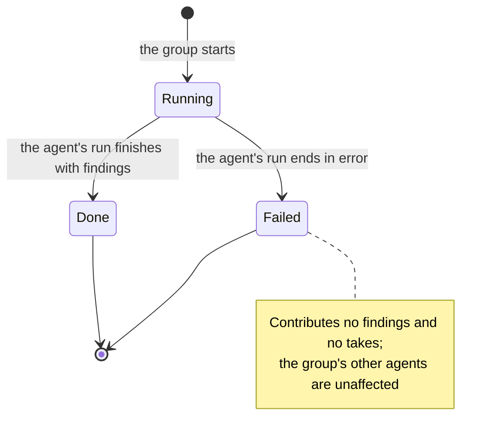

# SPEC-04: Multi-Agent Review

Status: approved
Modules: client, server, reviewer-core
Supersedes: —
Superseded by: —
Design refs:
`docs/specs/cross/_design/SPEC-04-multi-agent-review/01-pr-agent-picker.png`,
`02-configure-run-empty.png`,
`03-configure-run-agents-selected.png`,
`04-results-columns-live.png`,
`05-results-tabs-detail.png`

## Problem & why

A reviewer agent is a point of view, not an oracle. A security-shaped agent and
a readability-shaped agent looking at the same diff will disagree about what
matters, and the disagreement is the most useful thing either of them produces —
it is where a human's judgement is actually needed. Today the workspace can run
several agents on one pull request, but their output is read one run at a time,
in a history list, with no surface that puts two verdicts about the same line
next to each other. The comparison happens in the reader's head or not at all.

Two further things are invisible today. First, **what running more agents
costs**: a user choosing between one agent and four has no figure in front of
them before they commit, and no figure afterwards that lets them judge whether
the extra agents earned their money. Second, **whether the fan-out actually
fanned out**: agents that run in parallel and share one preparation of the diff
and the intent should not cost four times a single run in wall-clock time, but
nothing on screen says so.

The machinery to answer all of this already exists — a batched trigger that
prepares the diff and the intent once and runs each agent in an isolated
context, a live event stream with a replay buffer, a persisted trace per run, a
recorded duration and cost on every run, and a finding-grouping heuristic in the
eval scorer. This feature composes them into one surface and adds **no new model
call of its own**.

## Goals / Non-goals

**Goals**

- Let the user choose an arbitrary subset of the workspace's agents to run on one
  pull request, from the pull request itself or from a dedicated configure-run
  surface.
- State, before the run starts, what the selection is expected to cost in time
  and money, and be honest when part of that estimate is unknown.
- Run the selected agents as one group, in parallel, isolated from each other, so
  that one agent failing costs only that agent's result.
- Present the group's results side by side — one panel per agent — with each
  agent's own findings, its own score, its own duration and cost, and a route
  into the trace of its own run, during the run as well as after it.
- Present, deterministically and with no model call, the locations where the
  participating agents disagree — including where one flagged something the
  others did not.
- Present the run's total wall-clock time and total cost next to the per-agent
  figures, so a human can compare a four-agent run against a single-agent run of
  the same pull request themselves.

**Non-goals** — explicitly not part of this feature:

- **Any new model call.** Nothing in this feature calls a model except the agent
  reviews the user explicitly selected. The disagreement block in particular is
  computed from persisted findings; no model writes a word of it, no model
  summarises a row, and no model decides what a conflict is.
- **Merging, deduplicating or rewriting findings.** No agent's finding is ever
  collapsed into another's, re-titled, re-scored or re-attributed anywhere in
  this feature. The grouping heuristic is used for one purpose only: deciding
  which findings sit in the same row of the disagreement block.
- **A written comparison report.** The one-agent-versus-many question is answered
  by the figures on screen, not by a generated document.
- **The `Learn` and `Reply to author` finding actions** visible in design ref 05.
  Neither is accepted today; both stay out of scope.
- **Multi-run history.** The results surface presents the latest multi-agent
  review for a pull request. There is no run selector, no comparison between two
  multi-agent reviews, and no archive view.
- **A consensus verdict, a combined score, or a ranking of agents against each
  other.** Every score presented belongs to exactly one agent.
- **Changing how an agent produces, grounds, accepts or dismisses a finding.**
  This feature reads those and changes none of them.
- **Runs of agents that predate this feature.** Agent runs that were not started
  as part of a multi-agent review are not presented on the results surface and
  are not eligible for the disagreement block; they remain reachable exactly
  where they are reachable today.
- **A generated explanation for an agent that stayed silent.** An agent that did
  not flag a location gets a marker, never a sentence explaining its silence.

## User stories

- **US-1** As a reviewer looking at a pull request, I want to pick several agents
  and start them in one action, so that I do not have to trigger and track four
  separate reviews.
- **US-2** As a reviewer, I want to know roughly what a selection will cost in
  time and money before I start it, so that adding a fourth agent is a decision
  rather than a surprise.
- **US-3** As a reviewer, I want to watch each agent's panel fill in on its own,
  so that a slow agent does not hide the results of the fast ones.
- **US-4** As a reviewer, I want one agent's failure to leave the other agents'
  results intact and readable, so that a transient error costs me one column, not
  the whole review.
- **US-5** As a reviewer, I want to see exactly where the agents disagreed —
  including where only one of them said anything — so that I know which findings
  need my judgement rather than my agreement.
- **US-6** As a reviewer, I want each agent's findings to stay that agent's
  findings, so that I can weigh a claim against the reviewer that made it.
- **US-7** As a reviewer, I want to open the trace of any single agent's run,
  while it is still running or after it finished, so that a surprising finding
  can be traced to the prompt that produced it.
- **US-8** As someone deciding how to spend the workspace's model budget, I want
  the run's total time and cost next to each agent's own, so that I can judge
  whether four agents were worth it on this pull request.

## Workflow & module interaction

```mermaid
sequenceDiagram
  actor User
  participant Client as client
  participant Server as server
  participant Core as reviewer-core
  participant LLM

  User->>Client: Select agents (PR picker or configure-run surface)
  Client->>Server: Read each agent's most recent successful run
  Server-->>Client: That run's duration and cost as the estimate, or none
  Client-->>User: Per-agent estimates plus aggregate (max time, summed cost)
  User->>Client: Start the multi-agent review
  Client->>Server: Start a review for exactly this set of agents
  Server->>Server: Prepare the diff and the derived intent once for the whole set
  Server->>Server: Open one group; create one agent run per selected agent
  Server-->>Client: Group identity and the runs in it
  Client-->>User: Live status per agent, from the run event stream
  par One isolated context per selected agent
    Server->>Core: Shared diff + intent, this agent's configuration
    Core->>LLM: One call for this agent
    LLM-->>Core: Raw findings
    Core-->>Server: Grounded findings, duration, cost
    Server->>Server: Persist this agent's findings and its trace
    Server-->>Client: Run events for this agent only
  end
  Client->>Server: Read the group's runs, findings and totals
  Server-->>Client: Per-agent results and the group's totals
  Client->>Client: Group findings by location; derive conflict rows, no model call
  Client-->>User: Panels, totals, disagreement block
  User->>Client: Open a trace for one agent
  Client-->>User: Existing run trace surface for that agent's run
```

The observable state of one participating agent's run, as the results surface
presents it:



## Contracts (shape only)

**Multi-agent review** — the group of agent runs started together, from one
selection, for one pull request. It carries the pull request it is for, the time
it started, and the set of participating agents. The runs started together are
retrievable as exactly this group and as nothing wider; a run started outside a
multi-agent review belongs to no group and is never part of one.

**Participating agent panel** — for one agent in the group: the agent's identity
and its one-line description, the state of its run, its own duration and its own
cost, its own score, its own findings in the order that agent produced them, a
count of them, and a route into that run's trace. Panels are presented in a fixed
order derived from the order the agents were offered for selection, so the same
group always reads the same way.

**Estimate** — for one agent: the duration and the cost recorded for that agent's
most recent **successful** run in the workspace, or an explicit statement that no
estimate is available. It is a single-run lookup, not an average: the last
successful run wins outright, whatever came before it. For a selection: a
duration, a cost, and whether the aggregate is complete.

**Location** — a file path together with a line range. Two findings are at the
same location when they name the same file, after path normalisation, and their
line ranges overlap. This is the only place in the feature where findings from
different agents are related to each other, and a location is the **whole** of a
row's identity — there is no synthesized label for a row.

**Conflict row** — one location and one take per participating agent whose run
succeeded. Rows are ordered by file path and then by the start of the line range,
so the same findings always yield the same reading order. Nothing about a row is
persisted; it is derived on read from the findings the group's runs already
produced.

**Take** — one participating agent's position at a row's location. Either the
agent's severity at that location together with that agent's own finding title,
reproduced verbatim, or a marker stating that the agent did not flag the
location. A take never carries generated prose, an extracted sentence, a
reformatted string or a rationale. Where one agent produced more than one finding
at a location, its take carries the severity **and the title** of the most severe
of them.

**Conflict filtering** — a two-state control over the disagreement block. It is
off until the user turns it on, so the block presents every row by default
(AC-18) and filtering narrows it to conflict rows only (AC-22).

**Group totals** — the elapsed wall-clock duration of the group and the summed
cost of its runs, presented alongside the number of participating agents.

## Acceptance criteria (EARS)

**Starting a multi-agent review**

- **AC-1** WHEN the user activates the run-review control on a pull request, the
  system SHALL present a picker offering one selection control per agent
  available to run on that pull request (design ref 01).
- **AC-2** WHILE the configuration of a multi-agent review does not name both a
  pull request and at least one selected agent, the system SHALL NOT permit that
  review to be started.
- **AC-3** WHEN the user starts a multi-agent review from the pull request
  picker, the system SHALL leave the pull request surface presented with the live
  status of the started runs on it.
- **AC-4** WHEN the user selects the multi-agent review entry in the navigation,
  the system SHALL present the configure-run surface (design ref 02).
- **AC-5** WHEN the user starts a multi-agent review from the configure-run
  surface, the system SHALL present the results surface of the review that was
  started.
- **AC-6** WHEN a multi-agent review is started, the system SHALL run exactly the
  agents selected for it and no others.

**Estimating the selection**

- **AC-7** The system SHALL present, for each agent offered for selection, an
  estimated duration and an estimated cost equal to the duration and the cost
  recorded for that agent's most recent successful run anywhere in the workspace,
  irrespective of which pull request that run was for (design ref 03).
- **AC-8** IF an agent has no successful run in the workspace, THEN the system
  SHALL present that agent's estimate as unavailable rather than as a number, and
  SHALL present any aggregate estimate that includes it as incomplete.
- **AC-9** The aggregate estimate presented for a selection SHALL state a
  duration equal to the greatest of the available per-agent estimated durations
  in that selection and a cost equal to the sum of the available per-agent
  estimated costs in that selection.

**While the review runs**

- **AC-10** WHILE a multi-agent review is in flight, the system SHALL present the
  state of each participating agent's run independently of the states of the
  others (design ref 04).
- **AC-11** IF a participating agent's run fails, THEN the system SHALL present
  that agent as failed together with the reason it failed, while presenting every
  other participating agent's results unchanged by that failure.
- **AC-12** WHEN the user activates a participating agent's trace affordance, the
  system SHALL present the existing run trace surface for that agent's run,
  showing that run's live log while the run has not finished.

**Reading the results**

- **AC-13** WHEN the user opens the results surface for a pull request, the
  system SHALL present the most recently started multi-agent review of that pull
  request.
- **AC-14** IF a pull request has no multi-agent review, THEN the system SHALL
  present an empty state stating that none has been run and offering to configure
  one.
- **AC-15** The results surface SHALL present each participating agent's findings
  as that agent produced them and attributed to that agent, with no finding
  merged, collapsed, re-titled or re-scored.
- **AC-16** The results surface SHALL present the multi-agent review's total
  elapsed duration and total cost together with each participating agent's own
  duration and cost, exactly as recorded and without rounding or adjustment
  toward any expected relationship between them.
- **AC-17** A finding presented on the results surface SHALL offer exactly the
  accept, dismiss and turn-into-eval-case actions.

**Where agents disagree**

- **AC-18** The disagreement block SHALL present one row for each location at
  which at least one agent participating in the presented multi-agent review
  produced a finding, with one take in that row for each participating agent
  whose run succeeded and for no other agent.
- **AC-19** A take SHALL present the agent's severity at the row's location
  together with that agent's own finding title verbatim where that agent produced
  a finding there, and SHALL otherwise present only a marker stating that the
  agent did not flag that location.
- **AC-20** A row SHALL be presented as a conflict exactly when at least one
  participating agent produced a finding at its location while another
  participating agent whose run succeeded produced none, or when two
  participating agents produced findings at its location carrying different
  severities.
- **AC-21** IF a participating agent's run failed, THEN the system SHALL exclude
  that agent from every row of the disagreement block and from the determination
  of whether a row is a conflict.
- **AC-22** WHILE conflict filtering is enabled, the system SHALL present only
  rows that are conflicts.

**Accessibility of the new surfaces**

- **AC-23** WHEN a participating agent's run state changes while the results
  surface is open, the system SHALL announce the new state to assistive
  technology without moving keyboard focus.

## Edge cases

- **The configure-run surface before a pull request is chosen.** The
  agent-selection step presents an empty state stating that a pull request must
  be chosen first (design ref 02), and the start control is not activatable
  (AC-2). The step is present but inert — it is not hidden, because a step that
  vanishes is indistinguishable from a step that failed to load.
- **No agents in the workspace at all.** The picker and the configure-run surface
  present a statement that no agent is available in place of the selection list,
  and the start control is not activatable (AC-2). An empty list with an
  activatable button is the failure this rules out.
- **Zero agents selected.** The start control is not activatable (AC-2). The
  `Clear` link in design ref 01 therefore always leads to a non-startable state,
  which is correct — it is a way to restart a selection, not a way to run nothing.
- **One agent selected.** A multi-agent review of one agent is legitimate. Its
  results surface presents one panel, the aggregate estimate equals that agent's
  own, and the disagreement block is empty because no row can satisfy AC-20 with
  a single participant. It must not present an error or an empty-looking failure.
- **Very many agents selected.** Panels remain individually readable and the
  presentation does not depend on a particular number of them; the tabbed mode
  (design ref 05) exists precisely so that a wide selection stays readable.
- **An agent with many findings.** A panel's finding list is scrollable and
  states the agent's total finding count, so a truncated view can never be
  mistaken for the whole of that agent's output.
- **Every participating agent fails.** Every panel presents as failed with its
  own reason (AC-11), the disagreement block has no participants left and is
  empty (AC-21), and the group's totals still report the elapsed time and
  whatever cost was recorded. A run that cost money and produced nothing must not
  read as a run that found nothing.
- **A failed agent is not agreement.** A failed agent is absent from the
  disagreement block entirely (AC-21) — it is never presented as having "did not
  flag" a location, because silence caused by a crash is not a position.
- **One agent produced several findings at one location.** Its take carries the
  severity of the most severe of them and that same finding's title (Contracts,
  AC-19) — the severity and the title always come from one finding, never from
  two. The individual findings remain visible, unmerged, in that agent's own
  panel (AC-15).
- **Two agents flagged the same location with the same severity.** The row exists
  and shows both takes, but it is not a conflict (AC-20) and is therefore hidden
  while conflict filtering is enabled (AC-22). This is the only class of row that
  filtering removes.
- **Findings in the same file with non-overlapping line ranges.** They are
  different locations and produce two rows; nothing widens a line range to force
  a comparison.
- **Presentation mode and conflict filtering across a reload.** Conflict
  filtering starts off, so a results surface opened for the first time shows
  every row. Both the mode and the filter are then part of the results surface's
  addressable state, so reloading the surface — or sharing its address —
  presents the same mode and the same filtering. This matters because a run is
  watched live: a reload mid-run must not silently switch the reader back to a
  different view.
- **The filter is off by default and the heading still reads "where agents
  disagree".** A row fails to be a conflict only when every participating
  successful agent flagged the same location at the same severity (AC-20), which
  is uncommon at three or four agents — so with filtering off the block is in
  practice already almost entirely disagreement, and the heading in design refs
  04 and 05 is accurate as drawn. No rename is required, and the filter is a way
  to make the block strictly conflicts rather than a way to fix a misleading
  heading.
- **A reload in the middle of a run.** The live event stream's replay buffer
  already covers this: after a reload the panels present everything that has
  happened since the group started, not only what arrives afterwards.
- **A run finishing after the user has navigated away.** The runs continue and
  persist their findings and traces; the results surface presents them the next
  time it is opened (AC-13). Nothing about the group depends on a client staying
  connected.
- **Two multi-agent reviews started for the same pull request in quick
  succession.** The results surface presents the most recently started one
  (AC-13). The earlier group's runs continue, persist normally, and remain
  reachable through the pull request's existing run history — they are not
  cancelled and their findings are not discarded.
- **Runs that predate this feature.** Every agent run already in the workspace
  was started outside a multi-agent review and belongs to no group. It is not
  presented on the results surface and never becomes a participant or a take,
  so a pull request whose only runs predate this feature presents the empty state
  (AC-14). Estimates, by contrast, read those older runs as they are: an agent's
  most recent successful run counts whether or not it was part of a multi-agent
  review (AC-7), which is what stops every estimate reading as unavailable on the
  day this ships. The parent-grouping persistence slot in the starter schema holds
  no rows today, so no stored group needs migrating.
- **An agent deleted or disabled after a group ran.** The group's runs, findings
  and traces survive and are still presented with the agent identity they were
  recorded under; the agent simply stops being offered for selection.
- **An agent whose last successful run recorded no cost.** Its cost estimate is
  unavailable, never zero, and the aggregate that includes it is incomplete
  (AC-8). A free-looking selection is worse than an admittedly unknown one.
- **An agent whose every run failed.** It has no successful run, so it has no
  estimate and it makes the aggregate incomplete (AC-8) — exactly as an agent
  that has never run at all. A failed run's duration and cost are never presented
  as a prediction of a successful one.
- **One atypical last run skews the next estimate — accepted, not a defect.**
  Because the estimate is a single most-recent-successful-run lookup (AC-7) and
  not an average, one unusually large pull request, one slow provider response or
  one unusually short diff fully determines the figure shown next time, with no
  smoothing. This is deliberate: the estimate stays current and stays explainable
  ("this is what it cost last time") instead of being a number nobody can trace
  back to a run they can open. It is a known limitation to live with, not a bug
  to report.
- **The design refs show a take from an agent that did not participate.** Design
  refs 04 and 05 both show an "Architecture" take in the disagreement block while
  only four agents ran. That is an error in the mockups. AC-18 is the binding
  requirement: only the agents of this review appear.
- **The design refs show fewer takes than participants.** In the same two refs,
  each row shows three cells for a four-agent review. AC-18 is again binding: one
  take per participating agent whose run succeeded, in every row.
- **The design refs show a short label on every row.** Refs 04 and 05 head each
  row with a phrase ("Magic number 3600", "429 response shape") beside the
  location. This feature does not produce one: a phrase that fairly describes
  several agents' differing wording cannot be derived without a model call, and
  this feature makes none. A row is identified by its normalised file path and
  line range alone (Contracts). This is a deliberate departure from the refs, on
  the same grounds as the phantom agent above.
- **A finding title long enough to overflow its take.** Nothing truncates,
  summarises or reflows the title — it is reproduced verbatim (AC-19). Titles are
  short by construction, which is exactly why no truncation rule, sentence
  extraction or markdown-stripping rule is needed. How an unusually long one is
  laid out within its cell is a presentation concern — it wraps rather than being
  clipped — and it must never become a content rule that changes what the agent
  is shown to have said. The same holds for long explanations and long file paths
  in a panel.
- **A finding whose file or line information cannot be resolved to a location.**
  It is presented in its agent's own panel like any other finding and contributes
  no row and no take; the disagreement block never invents a location.

## Non-functional requirements

- The disagreement block SHALL be a function of the group's persisted findings
  alone: the same findings SHALL always produce the same rows, in the same order,
  with the same takes.
- Computing the disagreement block SHALL involve no model call.
- A multi-agent review SHALL perform exactly one model call per selected agent
  and no other model call on any path.
- The elapsed duration presented for a group SHALL be the wall-clock time between
  the group starting and its last run reaching a terminal state, not the sum of
  its runs' durations.
- Every control on the picker, the configure-run surface and the results
  surface — including each agent selection control, the presentation-mode
  control, the conflict filter and each trace affordance — SHALL be reachable and
  operable using the keyboard alone.
- Each agent selection control SHALL have an accessible name identifying the
  agent it selects; each trace affordance SHALL have an accessible name
  identifying the agent whose trace it opens.
- The presentation-mode control SHALL convey which mode is currently selected to
  assistive technology, and the conflict filter SHALL convey whether it is on.
- Every run state and every finding severity SHALL be conveyed by text as well as
  by icon or colour, on panels, tabs and takes alike.
- Every score presented on a panel or a tab SHALL be accompanied by its numeric
  value as text.
- Text and non-decorative indicators on the picker, the configure-run surface and
  the results surface SHALL meet a contrast ratio of at least 4.5:1 against their
  background.
- Interactive targets in the picker, in agent cards, on tabs and in takes SHALL
  be at least 24×24 CSS pixels.
- WHERE the user has expressed a reduced-motion preference, the in-flight
  indicator for a participating agent's run SHALL convey progress without
  continuous animation.
- A multi-agent review and its runs, findings, traces and totals SHALL be
  readable and writable only within the requesting user's workspace, on every
  path.
- This feature SHALL NOT define a time budget or a rate limit of its own; the
  per-call budget the model adapters already enforce and the workspace-wide
  request limit already apply to every call it makes.

## Inputs and provenance

| Input | Provenance |
|---|---|
| The set of agents offered for selection | `[reused: the workspace's agents]` |
| An agent's name, icon and one-line description | `[reused: the agent's configuration]` |
| Per-agent estimated duration and cost | `[deterministic: a lookup of that agent's most recent successful run in the workspace]` |
| Aggregate estimated duration and cost, and its completeness | `[deterministic: the per-agent estimates, no model call]` |
| The pull request diff | `[reused: the existing diff preparation, once per group]` |
| The derived pull request intent | `[reused: the existing intent derivation, once per group]` |
| Each agent's findings, score and verdict | `[new: 1 LLM call per selected agent — N calls for a selection of N agents]` |
| Per-agent duration and cost | `[deterministic: the accounting the review path already records]` |
| Group totals | `[deterministic: the group's runs, no model call]` |
| Live per-agent run state | `[reused: the existing run event stream and its replay buffer]` |
| The run trace and live log behind each trace affordance | `[reused: the existing per-run trace document and log]` |
| Location grouping of findings | `[deterministic: the existing same-file, overlapping-range heuristic]` |
| Conflict rows, conflict determination and takes | `[deterministic: the group's persisted findings, no model call]` |
| The title shown in a take | `[reused: the title of that agent's own finding]` |
| The eval-case creation path from a finding | `[reused: SPEC-03]` |

**This feature adds zero new model calls.** The only calls it makes are the N
agent reviews the user explicitly selected. Selection, estimation, grouping,
conflict determination, take contents, totals and every read path: zero.

**The estimate does not reuse the existing per-agent run rollup.** That rollup
carries a run count and a **mean** cost across an agent's runs; the estimate here
is the duration and cost of one specific run — the agent's most recent successful
one (AC-7). The two answer different questions and the existing aggregate cannot
stand in for this one.

## Untrusted inputs

Foreign text this feature reads:

- **The pull request diff, title and body** — authored outside DevDigest, by
  whoever opened the pull request. It is the root of everything else on this
  surface.
- **Finding titles, explanations, suggested fixes, categories and file
  references** — model output derived from that diff, produced by each
  participating agent.
- **Each agent's verdict and summary** — model output, presented at the head of a
  panel or tab.
- **The title shown in a take** — the same model output again, reproduced
  verbatim from the agent's own finding, selected mechanically.
- **The raw output and the live log behind a trace affordance** — model output
  and prompt text, rendered verbatim in the existing trace surface.
- **Agent names and descriptions** — authored inside the workspace, but rendered
  as text on both selection surfaces and in every panel, tab and take.

Handling:

- Every one of these is **data to render, never an instruction**. No text from a
  diff, a finding, a summary, a title, a trace or an agent description is
  interpreted as a command, executed, or used to decide what the application
  does next.
- No text on this surface is echoed into any prompt. This feature assembles no
  prompt of its own: the only prompts it causes are the ordinary agent reviews,
  assembled by the existing review path with its existing wrapping of the diff as
  data.
- A take reproduces the agent's finding title mechanically. No wording in a
  finding can change which row it lands in, whether a row is a conflict, or which
  agents appear — those follow from file path, line range, severity and
  participation only. Reproducing a title verbatim rather than extracting from it
  also removes a whole class of parsing bug: there is no sentence splitter, no
  markdown stripper and no truncator for a hostile title to defeat.
- All of it is presented as inert content: no active content, no automatic
  requests to addresses named in the text, and no rendering path that treats
  model output as markup with behaviour.
- File paths in findings are rendered as references, and are never used to read
  from the filesystem on this surface.
- Groups, runs, findings, traces and totals are workspace-scoped on every path,
  including the read paths that perform no model call.

## Traceability

| AC | Verified by |
|---|---|
| AC-1 | e2e flow |
| AC-2 | unit |
| AC-3 | e2e flow |
| AC-4 | e2e flow |
| AC-5 | e2e flow |
| AC-6 | server integration |
| AC-7 | unit |
| AC-8 | unit |
| AC-9 | unit |
| AC-10 | unit |
| AC-11 | server integration |
| AC-12 | unit |
| AC-13 | server integration |
| AC-14 | unit |
| AC-15 | unit |
| AC-16 | unit |
| AC-17 | unit |
| AC-18 | unit |
| AC-19 | unit |
| AC-20 | unit |
| AC-21 | unit |
| AC-22 | unit |
| AC-23 | unit |

## Open questions

**None remain.** Every question raised while drafting has been decided; the
decisions are recorded below and where they bind, so that a later reader does not
have to rediscover that the alternatives were considered.

Decisions already taken, recorded so they are not reopened:

| Decision | Where it binds |
|---|---|
| No model call anywhere in this feature beyond the N selected agent reviews | Non-goals, NFRs, Inputs and provenance |
| An agent's estimate is the duration and cost of its **most recent successful run**, workspace-wide — not a mean, not a median, not a windowed average, and not scoped to the pull request being reviewed | AC-7, Contracts, Inputs and provenance |
| The estimate therefore does **not** reuse the existing per-agent run rollup, which is a mean cost across all runs and answers a different question | Inputs and provenance |
| A single-run estimate has no smoothing: one atypical last run fully determines the next figure shown. Accepted as the price of a current, traceable signal | Edge cases |
| An agent with no successful run — never run, or every run failed — shows no estimate and makes the aggregate incomplete | AC-8, Edge cases |
| A take is a severity plus that agent's own finding **title, verbatim** — never a rationale, an extracted sentence, or a truncated or reformatted string | AC-19, Contracts |
| Titles are short by construction, so no truncation, sentence-extraction or markdown-stripping rule is needed; overflow is presentation, not content | Edge cases, Untrusted inputs |
| Where an agent has several findings at one location, its take takes the severity **and** the title from the single most severe one | AC-19, Contracts, Edge cases |
| A conflict row is identified by its location alone; **no synthesized short label**, contrary to design refs 04 and 05, because deriving one from several agents' differing wording would need a model call | Contracts, Edge cases |
| Conflict filtering is **off by default**; the block shows every row until the user turns it on | Contracts, AC-18, AC-22, Edge cases |
| The "where agents disagree" heading stays as the design refs have it: with the filter off the block is in practice already almost entirely disagreement, so no rename is warranted | Edge cases |
| Grouping is used only for the disagreement block; panels and tabs never merge anything | Non-goals, AC-15, AC-18 |
| Finding actions are accept, dismiss and turn into eval case; Learn and Reply to author are out of scope | Non-goals, AC-17 |
| The one-versus-many question is answered by the displayed figures, never normalised toward an expected ratio | AC-16 |
| Starting from the pull request picker keeps the user on the pull request | AC-3 |
| The results surface always presents the latest multi-agent review; no run selector | Non-goals, AC-13 |
| A failed agent is excluded from the disagreement block rather than counted as silent agreement | AC-21 |
| Only the agents of the presented review appear in the block, contrary to design refs 04 and 05 | AC-18, Edge cases |
