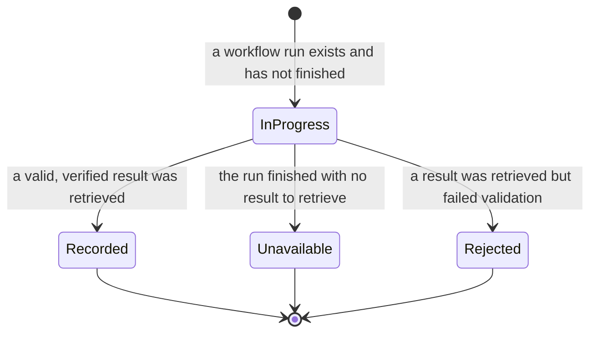

# SPEC-05: Export to CI

Status: approved
Modules: client, server, agent-runner
Supersedes: —
Superseded by: —
Design refs:
`docs/specs/cross/_design/SPEC-05-export-to-ci/1.png` (wizard · target),
`2.png` (agent CI view, entry point),
`3.png` (wizard · preview),
`4.png` (wizard · configure),
`5.png` (wizard · install)

The target step carries a required target-repository control — a searchable
chooser over the workspace's repositories, labelled with the repository's
`owner/name`. This is a revision the user supplied after `1.png` was drawn;
`1.png` shows the four platform cards only.

## Problem & why

An agent tuned in the studio only reviews what its author personally asks it to
review, on one laptop. A team cannot rely on it: the reviews that matter are the
ones that happen on every pull request, for everyone, whether or not the agent's
author is at their desk.

A tuned agent is not a running process — it is a versioned configuration: a
model, a system prompt, a set of attached skills, a strategy and a failure
threshold. Once that configuration lives in the repository instead of in one
person's workspace, the same review can run in the repository's own CI, be
reviewed like any other change, and be blocked on like any other check.

Two things must be true for this to be worth doing.

**The configuration, not the output, is what is reproduced.** An identical
manifest guarantees an identical *configuration*; it does not guarantee an
identical *result*. Model responses vary and CI machines carry different tool
versions. A CI result is therefore only explainable if it records what produced
it: which manifest version, which model, which runner build, and which commit.
Without that record, a disagreement between a local run and a CI run has no
resolution.

**The path into CI is a security decision, not a convenience.** The generated
workflow runs in someone's repository with that repository's credentials, and
the material it reviews is written by whoever opened the pull request. The
export therefore hands the user a change to *review*, not a change to *trust*:
it opens a pull request on its own branch, never writes to the default branch,
asks for the narrowest permissions the job needs, and keeps the model
credential in the repository's own secret store where the studio can never read
it.

## Goals / Non-goals

**Goals**

- Turn an agent's current configuration into a set of files that a repository
  the user chooses can run, and show the user every one of those files before
  anything is written.
- Let the user correct the generated workflow before it is installed.
- Let the user choose which pull-request events trigger the review and how the
  result is published, and carry both choices through to what actually runs.
- Install by opening a pull request on a dedicated branch, so a human reviews
  the workflow, the permissions and the runner before any of it executes.
- Tell the user which secrets the workflow expects and which of them are already
  available, without ever handling a secret's value.
- Record, per repository, that an agent is installed and which version of the
  workflow it was installed with, and show that agent's recent CI runs beside
  its installations.
- Present the runs that CI produced — repository, pull request, agent, verdict,
  findings, cost, duration and a link to the job — pulled back into the studio
  over an authenticated connection and verified before being recorded.
- Behave predictably on a fork pull request, where the credentials the review
  needs are deliberately unavailable.

**Non-goals** — explicitly not part of this iteration:

- **Any target other than GitHub Actions.** The three other targets remain
  visible on the target step as unavailable options (design ref 1); nothing
  generates, validates or installs for them.
- **Installing by download.** "Copy files as a zip" (design ref 5) stays visible
  and inert. No archive is produced.
- **The agent's memory file.** Design ref 3 lists a memory file among the files
  to create. That feature does not exist and the runner does not read it — this
  is a deliberate, known deviation from the mockup. The bundle is: the agent
  manifest, one file per attached skill, the bundled runner, and the workflow.
- **A published marketplace action.** Design ref 3 shows a versioned third-party
  action; no such action exists and none is generated. The workflow executes the
  runner that ships in the same pull request.
- **A separate update path for an already-installed agent.** Design ref 2 shows
  an update-CI-config control; this iteration does not implement it.
  Re-exporting an installed agent happens through the same add-to-CI wizard,
  which reuses the existing branch and pull request.
- **Any inbound network surface.** The studio is local-first. It opens no
  endpoint, tunnel or callback for CI to push results to, and accepts no result
  that it did not itself retrieve.
- **Configuring branch protection.** Blocking a merge needs a required status
  check in the repository's own settings. This feature explains that and does
  not do it.
- **Reading, storing or displaying a secret's value**, including checking
  whether a stored secret is correct.
- **Automatic or scheduled retrieval of CI results.** Results arrive only when
  the user asks for a refresh, and a refresh looks only at each installation's
  most recent runs — there is no time window, no paging and no catching up on
  older history.
- **Re-running a CI review from the studio**, editing a CI run, or turning a CI
  finding into anything else.
- **Surfacing a CI run anywhere but its own two screens.** CI Runs and the
  agent's CI view are the only places a CI run appears; the studio's
  pull-request pages are untouched, including for a pull request that has been
  imported and also reviewed in CI.
- **Changing local review behaviour.** The multi-run service, the pull-request
  feed and the local review path are untouched by this feature.

## User stories

- **US-1** As an agent author, I want my tuned agent to review every pull
  request in a repository, so that the team stops depending on me running it.
- **US-2** As the person who owns that repository, I want the change that
  installs it to arrive as an ordinary pull request I can read, so that I can
  judge its permissions and what it executes before it ever runs.
- **US-3** As an agent author, I want to see every generated file before
  anything is written, and to correct the workflow if my repository needs
  something different.
- **US-4** As an agent author, I want to be told which secrets the workflow needs
  and which are already there, so that the first run does not fail for a reason
  nobody explained.
- **US-5** As a reviewer, I want a critical finding to turn the check red, so
  that the agent's opinion has consequences.
- **US-6** As an agent author, I want to see the runs CI produced, with their
  verdict and cost and a link to the job, so that the agent's behaviour off my
  machine is not invisible to me.
- **US-7** As a maintainer, I want a pull request from a fork to behave
  predictably rather than failing with a credential error nobody can act on.
- **US-8** As anyone reading a CI result, I want to know which configuration,
  model and commit produced it, so that a disagreement with a local run can be
  explained rather than argued about.

## Workflow & module interaction

Export and installation, then the first CI run, then the result coming back.

```mermaid
sequenceDiagram
  actor User
  participant Studio as client
  participant Server as server
  participant GitHub
  participant Runner as agent-runner (in CI)

  User->>Studio: Add to CI, from the agent's CI view
  User->>Studio: Choose GitHub Actions and the target repository
  Studio->>Server: Generate the export for this agent and that repository
  Server->>Server: Serialize the manifest, the attached skills and the workflow
  Server->>Server: Take the pre-built runner from the local checkout
  Server-->>Studio: Every file, with its contents
  Studio-->>User: Preview, with the workflow open to editing
  User->>Studio: Trigger events, publication mode; secrets are only reported on
  User->>Studio: Confirm installation
  Studio->>Server: Install
  Server->>GitHub: Commit the files to the CI branch, opening it if absent
  Server->>GitHub: Open, or update, the pull request from that branch
  GitHub-->>Server: Pull request location
  Server->>Server: Record the installation and the workflow version
  Server-->>Studio: Pull request location
  User->>GitHub: Review and merge that pull request, add the model credential

  Note over GitHub,Runner: later, on a pull request in that repository
  GitHub->>Runner: Run the workflow with the repository's credentials
  Runner->>Runner: Load and validate the manifest and skills
  Runner->>GitHub: Fetch the pull request diff
  Runner->>Runner: Review through the existing pipeline, grounding gate included
  Runner->>Runner: Compute the verdict from grounded findings and the threshold
  Runner->>GitHub: Publish the result in the chosen way
  Runner->>GitHub: Attach the result record to the workflow run
  Runner-->>GitHub: Non-zero exit only when the gate blocks

  User->>Studio: Refresh CI runs
  Studio->>Server: Refresh
  Server->>GitHub: The latest runs of the DevDigest workflow, per installation
  Server->>Server: Skip every run already recorded
  Server->>GitHub: The result attached to each remaining run, authenticated
  Server->>Server: Validate the shape, then repository, pull request and commit
  Server->>Server: Record the run, against its installation and agent
  Server-->>Studio: Runs
  Studio-->>User: CI Runs, and the same runs on the agent's CI view
```

The observable states of one CI run, as the studio can see them:



## Contracts (shape only)

**Exported agent configuration (the manifest).** Carries the agent's name, the
provider and model it runs on, its system prompt, the identifiers of the skills
attached to it, its review strategy, and the severity at which a run blocks. A
manifest also carries a **version of its own shape**, so a result can name the
manifest version that produced it. The studio writes this and the runner reads
it, validated against one shared definition on both sides — a manifest the
studio would write and the runner would reject is the failure this contract
exists to prevent. It must be written where the bundled runner already looks for
it; this spec does not restate those locations, because they are already fixed
by shipped code.

**Export request.** Carries the target platform, the repository the user chose,
the branch the installation pull request targets, the pull-request event types
that trigger the review, and how the result is published (as a review, as a
comment, or not at all). The repository and the platform are both chosen on the
target step; neither is inherited from whatever the workspace happens to be
pointed at.

**Generated file.** A path, its contents, and whether the user may edit those
contents before installation. Exactly one generated file — the workflow — is
editable; the manifest, the skill files and the runner are presented read-only,
because each is a faithful serialization of something the user edits elsewhere
or of a build artefact, and an edit to any of them would silently diverge from
the agent it claims to represent.

**Installation.** Carries the agent, the repository, the target platform, when
it was installed, and **the version of the workflow that was installed**. That
last field is what makes "your installed workflow is out of date" answerable.

**Workflow version.** An identifier the export stamps into the workflow it
generates, and records on the installation. It changes when the studio's
generator changes what the workflow does. It is compared for equality only —
nothing orders two versions.

**CI result record** — what a CI run attaches to its workflow run for the studio
to retrieve. Carries: the count of findings and their split by severity, the
**verdict** the deterministic gate produced, the cost, the duration, the agent's
name, the pull request number, **the repository identity**, **the commit that
was reviewed**, and **the manifest version, the model and the runner build that
produced it**. It carries no secret and no finding text.

**CI run.** What the studio records after verifying a result: the installation
it belongs to, the pull request, the agent, the verdict, the finding counts, the
cost, the duration, when it ran, and the location of the job that produced it.
The installation is what makes a run attributable to an agent — both the agent's
CI view (AC-23) and the agent's run history (AC-24) read it that way. Attribution
is by construction: a refresh looks for runs one installation at a time, so a run
that cannot be traced to an installation is never retrieved in the first place.

**Run history entry.** A CI run also belongs in the same history that a review
run started from the studio belongs in, carrying an origin that distinguishes
the two. A CI review and a local review of the same pull request must never be
counted as one, nor a CI review presented as something the user ran.

**Contract gaps the plan must close.** The starter contracts do not yet carry
enough for the above:

- The result record has no commit identity and no repository identity. Without
  both, the verification AC-15 requires is impossible — a result could be
  attached to any workflow run at all and would still validate.
- The result record has no verdict, no manifest version, no model and no runner
  build. The verdict is what AC-16 and AC-23 present; the other three are what
  make a result explainable at all (US-8).
- The CI run record has no verdict either, and its single status field today
  conflates "the job finished" with "the review found nothing" — the CI Runs
  screen needs those separately.
- The installation record has no workflow version (AC-8, AC-9).
- Nothing carries the publication mode from the export to the runner: the export
  request captures the user's choice, the manifest has no field for it, and the
  runner falls back to a default. AC-11 cannot hold until that path exists.
- The same is true of the trigger event types (AC-20, AC-21): the export request
  captures them, and they must reach the generated workflow itself — a workflow
  generated from a fixed set of events would satisfy the mockup and fail AC-21.
- Nothing connects a recorded run to an agent except through its installation,
  and the run record does not carry the agent's identity directly. AC-23 and
  AC-24 both need that link to exist and to survive an agent being installed in
  more than one repository.

## Acceptance criteria (EARS)

Identifiers are append-only: a criterion added after the first draft takes the
next free number and sits beside the ones it belongs with, so the numbers do not
run in reading order. Read them as names, not as positions.

**Opening the wizard and generating the files**

- **AC-1** WHEN the user activates the add-to-CI control on an agent's CI view,
  the system SHALL present the export wizard at its target step.
- **AC-19** IF no target repository has been chosen on the target step, THEN the
  system SHALL prevent the export wizard from leaving that step.
- **AC-2** WHEN the export wizard presents its preview step, the system SHALL
  present the contents of every file the export would add: the agent manifest,
  one file for each skill attached to that agent, the review runner, and the
  workflow.
- **AC-22** WHEN the user modifies the workflow contents on the preview step,
  the system SHALL install the contents as modified.
- **AC-3** IF the workflow contents cannot be interpreted as a workflow
  definition, THEN the system SHALL prevent the export from continuing and state
  the reason next to the workflow contents.
- **AC-20** WHILE the export wizard presents its configure step, the system SHALL
  present each pull-request event type that can trigger the review as
  individually selectable.
- **AC-21** The generated workflow SHALL be triggered by exactly the pull-request
  event types selected on the configure step and by no other event.
- **AC-4** WHILE the export wizard presents its configure step, the system SHALL
  state, for each secret the generated workflow expects, whether that secret is
  already available to the workflow without further action by the user.
- **AC-5** IF the pre-built review runner is not available when the export is
  generated, THEN the system SHALL refuse the export and state that the runner
  is unavailable.

**Installing**

- **AC-6** WHEN the user confirms installation, the system SHALL commit the
  generated files to a branch of the target repository dedicated to DevDigest CI
  configuration, and never to that repository's default branch.
- **AC-7** WHEN the generated files have been committed, the system SHALL
  present the location of the pull request that carries them.
- **AC-8** WHEN the export has opened or updated that pull request, the system
  SHALL record an installation carrying the agent, the repository and the
  version of the workflow it installed.

**The agent's CI view**

- **AC-9** WHEN the user selects the CI view of an agent, the system SHALL
  present each repository that agent is installed in, stating for each whether
  the installed workflow version is the version the export would generate now.
- **AC-10** WHEN the user changes the agent's CI failure threshold, the system
  SHALL state that the change reaches CI only after the agent is exported to
  that repository again.
- **AC-23** WHEN the user selects the CI view of an agent, the system SHALL
  present the most recent CI runs recorded for that agent.

**What runs in CI**

- **AC-11** WHEN a CI run publishes its result, the system SHALL publish it in
  the way chosen on the configure step of the export that installed it.
- **AC-12** IF the pull request being reviewed originates from a fork of the
  repository, THEN the system SHALL end that CI run with a passing check and a
  statement that pull requests from forks are not reviewed.
- **AC-13** The system SHALL NOT include the value of any secret in a generated
  file, in a published result, in a retrieved result, in a stored run record, or
  in any output a CI run produces.

**Bringing results back**

- **AC-14** The system SHALL record a CI run only from a result that the studio
  itself retrieved over an authenticated connection to the code-hosting
  platform.
- **AC-15** IF a retrieved result does not conform to the agreed result shape, or
  names a repository, pull request or commit other than those of the workflow
  run it was retrieved from, THEN the system SHALL NOT record a CI run from it.
- **AC-16** WHEN the user selects CI runs in the navigation, the system SHALL
  present each recorded run with its repository, its pull request, its agent,
  its verdict, its finding count, its cost, its duration and the location of the
  job that produced it.
- **AC-24** WHEN a CI run is recorded, the system SHALL record it in the same run
  history that a review run started from the studio is recorded in, identified as
  having originated in CI rather than in the studio.

**Accessibility of the wizard**

- **AC-17** WHILE the export wizard is open, the system SHALL confine keyboard
  focus to the wizard.
- **AC-18** WHEN the export wizard moves to another step, the system SHALL place
  keyboard focus at the start of that step's content.

## Edge cases

- **No repository imported.** The target step's repository chooser has nothing to
  offer, so the step can never be advanced (AC-19). The add-to-CI control is
  therefore not activatable in the first place and states that a repository must
  be imported first — a wizard that opens onto a dead end is worse than a control
  that explains itself.
- **A search that matches no repository.** The chooser states that nothing
  matched and leaves the previous choice, if any, unchanged. An empty result is
  not a deselection.
- **The trigger events the configure step opens with.** Opened and synchronize
  are selected, reopened is not (design ref 4).
- **Every trigger deselected.** At least one pull-request event type must remain
  selected; with none selected the configure step cannot be advanced and states
  that a trigger is required. A workflow that never runs is not a configuration
  anyone meant to choose, and it would install silently and look healthy.
- **An agent with no attached skills.** A valid export: the manifest lists no
  skills and no skill file is generated. The preview says so rather than showing
  an empty file list section.
- **The agent is already installed in the chosen repository.** The export
  regenerates every file from the agent's current configuration and updates the
  installation's workflow version once the pull request exists. Nothing is
  merged, and the previous installation record is not duplicated — one agent has
  at most one installation per repository.
- **The CI branch already exists, or an open pull request from it already
  exists.** The files are committed onto the existing branch and added to the
  existing pull request; a second pull request is never opened. The user sees the
  same location (AC-7) as before.
- **The export fails partway** — the branch is created but the commit fails, or
  the commit succeeds but the pull request cannot be opened. No installation is
  recorded (AC-8 requires a pull request), the failure names the step it stopped
  at, and a retry is safe because the branch and pull request are reused rather
  than duplicated.
- **No credential for the repository, or one that cannot write to it.**
  Installation is prevented and the wizard states that write access to the
  repository is required. Nothing is generated into the repository. Generation
  and preview do not require write access, so the user can still see what would
  be installed.
- **The user edits the workflow, then goes back a step and forward again.**
  Edits made on any step survive moving between steps within one wizard session;
  closing the wizard discards them.
- **The user edits the workflow into something that no longer runs the review**
  — a valid definition that removes the runner step. The export cannot detect
  this and does not try to. It is exactly why installation is a pull request a
  human reads (US-2).
- **An installation recorded before workflow versions existed** — none exists
  today, because no installation has ever been recorded, but an installation
  whose version is unknown is presented as not current rather than as current.
- **An agent stored before this feature** carries no explicit CI failure
  threshold; it is exported with the default threshold, and the CI view states
  which threshold was exported.
- **A workflow run that has not finished.** Presented as in progress, with no
  verdict and no counts. A verdict is never inferred from an unfinished run.
- **A finished workflow run with no result to retrieve** — the runner failed
  hard, or the platform expired the attached result. Presented as unavailable
  with that reason and a link to the job, never as a run with zero findings. A
  zero-finding review and a review that never happened must not look alike.
- **A result that fails validation.** No run is recorded (AC-15); the refresh
  states that a result was rejected and for which workflow run, so a mismatch is
  visible rather than silent.
- **The same workflow run retrieved twice.** A run already recorded is skipped
  before its result is fetched at all, and the existing record is left unchanged.
  Refreshing repeatedly does not multiply runs and does not re-fetch what it
  already has.
- **How far back a refresh looks.** For each installation, the studio retrieves a
  fixed, small number of that repository's most recent DevDigest workflow runs —
  on the order of the last twenty — most recent first. There is no time window,
  no paging, no cursor and no background or scheduled retrieval. A run older than
  that window is never picked up, and this iteration accepts that: the studio is
  a local tool a person opens, not a system of record for CI history.
- **A result for a pull request the studio has never imported.** The run is still
  recorded and presented — it identifies its pull request by number and links to
  the job. Nothing about a CI run requires the pull request to exist locally.
- **A fork pull request, end to end.** The wizard says nothing special (the
  generated workflow is the same one). The run ends passing with a statement
  that fork pull requests are not reviewed (AC-12). CI Runs shows it as a run
  that produced no review, not as a failure.
- **An installation with no runs yet** — the pull request is unmerged, or merged
  but no pull request has been opened since. Its row on the agent's CI view
  states that no run has been recorded for it, rather than showing an empty
  outcome that reads as a failure, and the agent's CI view presents no run
  history at all when none of its installations has produced one.
- **No installation anywhere.** CI Runs is presented, empty, stating that no
  agent is installed in any repository, with the way to install one named.
- **Very many runs.** Runs are presented most recent first. This iteration
  defines no other ordering and no filtering.
- **A repository whose installation pull request was never merged.** No workflow
  runs exist, so no runs appear. The installation is still listed on the CI view
  — it records what was proposed, not what was merged, and this spec does not
  make the studio detect the difference.

## Non-functional requirements

- The generated workflow SHALL grant its job no more than read access to the
  repository's contents and write access to its pull requests; every other
  permission SHALL be left unrequested.
- The generated workflow SHALL be triggered only by pull-request events that
  withhold repository secrets from code originating in a fork, and SHALL NOT use
  a trigger that grants a fork's code access to those secrets or to a writable
  credential.
- Every external component the generated workflow depends on SHALL be pinned to
  an exact immutable revision.
- The model credential SHALL be read only from the repository's own secret
  store, by the running job, and SHALL never be written into a generated file,
  the manifest, a retrieved result or a stored record.
- A retrieved result SHALL be validated against the agreed shape before any part
  of it is stored or presented.
- Installations and CI runs SHALL be readable and writable only within the
  requesting user's workspace, on every path.
- Each unavailable target on the target step SHALL convey its unavailability as
  text, not by dimming alone, and SHALL NOT be selectable by keyboard or
  pointer.
- Each wizard step SHALL convey which step is current and how many remain, as
  text and not by colour alone.
- The target-repository chooser SHALL be operable entirely from the keyboard,
  including reaching and choosing a repository from its filtered results.
- The number of repositories a search has narrowed to SHALL be announced to
  assistive technology, and SHALL NOT be announced more than once per completed
  search.
- Each trigger option SHALL convey whether it is selected as text, not by colour
  or outline alone.
- A verdict, a run status and a secret's readiness SHALL each be conveyed by
  text, not by colour or icon alone.
- A failure raised by the wizard SHALL be announced to assistive technology
  without moving keyboard focus away from where the user is working.
- The editable workflow contents SHALL be operable entirely from the keyboard,
  including leaving the editor without inserting a character.
- Text and non-decorative indicators in the wizard, the CI view and CI Runs SHALL
  meet a contrast ratio of at least 4.5:1 against their background.
- Interactive targets in the wizard, on installation rows and on CI run rows
  SHALL be at least 24×24 CSS pixels.

## Inputs and provenance

| Input | Provenance |
|---|---|
| The target repository, the trigger event types and the publication mode | `[deterministic: the user's choices on the target and configure steps]` |
| The agent's name, model, system prompt, strategy and failure threshold | `[reused: the agent's stored configuration]` |
| The bodies of the skills attached to the agent | `[reused: the stored skills]` |
| The workflow contents | `[deterministic: generated from the export request and the agent, then as edited by the user]` |
| The workflow version | `[deterministic: the studio's generator]` |
| The review runner shipped in the bundle | `[reused: the pre-built runner in the local checkout]` |
| Which secrets the workflow expects, and which are already available | `[deterministic: derived from the generated workflow and from what the platform provides automatically — never from a secret's value]` |
| The pull-request diff reviewed in CI | `[deterministic: fetched from the code-hosting platform by the run]` |
| The findings of a CI review | `[new: the model calls the existing review pipeline already makes for one review — this feature adds none of its own]` |
| The verdict and the exit status of a CI run | `[deterministic: the existing grounding gate and failure threshold, never the model's self-reported verdict]` |
| The manifest version, model and runner build recorded on a result | `[deterministic: read from the manifest and the runner at run time]` |
| Recent workflow runs and their attached results | `[deterministic: retrieved from the code-hosting platform over an authenticated connection]` |
| Everything shown on CI Runs and on the agent's CI view | `[reused: the recorded installations and runs]` |

Model calls added by the studio side of this feature: **none.** A CI run costs
exactly what the same review costs locally, and every other path here —
generation, installation, refresh, both screens — performs zero.

## Untrusted inputs

Foreign text this feature reads or produces:

- **The pull-request diff** reviewed in CI — written by whoever opened the pull
  request, including someone with no access to the repository.
- **The pull-request title and body**, and the branch name they arrive with.
- **Repository source and any comment on the pull request** the run can see.
- **The agent's system prompt and skill bodies** — authored inside the
  workspace, but serialized into a file that then lives in someone else's
  repository and can be edited there.
- **Everything retrieved from the code-hosting platform on refresh** — workflow
  run metadata and the attached result record, both of which a repository
  collaborator can influence.
- **Model output**, rendered as findings and summarised into counts.

Handling:

- Diff, title, body and comments enter the model prompt as data, wrapped exactly
  as the existing local review path wraps them, and never merged into an
  instruction section. This is already true of the shipped runner and must stay
  true.
- No text taken from a pull request, a branch name, a comment or a diff is ever
  used to build a command, a path, or an instruction carrying more privilege
  than the text itself has.
- The generated workflow never executes code from a fork with a writable
  credential or with the model credential present. This is the reason AC-12
  exists: withholding the credential is the correct behaviour, and the run must
  end saying so instead of failing on a missing key.
- A retrieved result is validated for shape, then checked against the
  repository, pull request and commit of the workflow run it came from, before
  any part of it is stored (AC-15). A result is data about a run, never a claim
  about which run it belongs to.
- Retrieved text is presented as inert content: no active content, no automatic
  request to any address it names, no interpretation as an instruction.
- The studio exposes nothing inbound. Every result arrives because the studio
  asked for it, authenticated, from a place it already trusts (AC-14).

## Traceability

| AC | Verified by |
|---|---|
| AC-1 | e2e flow |
| AC-2 | server integration |
| AC-3 | unit |
| AC-4 | unit |
| AC-5 | server integration |
| AC-6 | server integration |
| AC-7 | e2e flow |
| AC-8 | server integration |
| AC-9 | unit |
| AC-10 | unit |
| AC-11 | unit |
| AC-12 | unit |
| AC-13 | unit |
| AC-14 | server integration |
| AC-15 | server integration |
| AC-16 | unit |
| AC-17 | unit |
| AC-18 | unit |
| AC-19 | unit |
| AC-20 | unit |
| AC-21 | server integration |
| AC-22 | server integration |
| AC-23 | unit |
| AC-24 | server integration |

The end-to-end lab exercise this feature exists for — export into a fork of a
demo repository, review the generated pull request by hand, add the model
credential, merge, open a test pull request in that same repository, set the
failure threshold to critical, and confirm that a critical finding turns the
required check red while the run appears in CI Runs with no secret in any log or
attached file — is **manual**. It exercises AC-6 through AC-16 together, plus
AC-21 (the workflow really does fire on the chosen events), AC-22 (the workflow
that runs is the one the user edited) and AC-24, and is not reducible to an
automated check.

## Open questions

None. The four questions raised while drafting have been answered; the answers
are recorded where they bind, and listed here so a later reader does not have to
rediscover that the alternatives were considered.

| Decision | Where it binds |
|---|---|
| The target repository is chosen on the target step, from a searchable chooser over the workspace's repositories, and the step cannot be advanced without one | Design refs, Contracts, AC-19, Edge cases |
| No separate update-CI-config path; re-export goes through the same wizard and reuses the branch and pull request | Non-goals, Edge cases, AC-6, AC-7 |
| A refresh retrieves a fixed, small number of each installation's latest runs, skips those already recorded, and never pages or polls | Non-goals, Workflow, Edge cases, AC-14 |
| A CI run appears only on CI Runs and on the agent's CI view; pull-request pages are untouched | Non-goals, AC-16, AC-23 |
