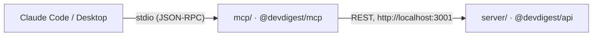

# `@devdigest/mcp` — local stdio MCP server

Exposes DevDigest to Claude Code / Claude Desktop over a local **stdio** MCP
server: five tools that let a coding agent list reviewer agents, run one on a
pull request, read its findings, and read a repository's extracted coding
conventions — all against the DevDigest API you already have running at
`http://localhost:3001`. This package never touches Postgres, GitHub, an LLM,
the filesystem, or secrets directly; it is a thin HTTP client of the API,
nothing else.



## The five tools

| Tool | Arguments | What it does |
|------|-----------|---------------|
| `list_agents` | — | List reviewer agents (name, description, provider, model, enabled). Start here. |
| `run_agent_on_pr` | `repo`, `pr`, `agent` | Run one agent on one PR and wait for the result (may take minutes). The only write tool. |
| `get_findings` | `repo`, `pr`, `agent`, `run_id?`, `severity?`, `file?`, `limit?`, `detail?` | Findings from a review that already completed — use instead of re-running an agent. |
| `get_conventions` | `repo`, `limit?` | Accepted/pending coding conventions extracted for a repository. Read-only — never runs extraction. |
| `get_blast_radius` | `repo`, `pr`, `depth?` (accepted for input-schema stability, ignored — traversal is fixed at 2 hops) | Symbols, callers and HTTP endpoints a pull request's changed files reach through the import graph — a pure Postgres read over the `repo-intel` index, no LLM call. |

`repo` is always `"owner/name"` (a GitHub URL also works); `pr` is the pull
request number; `agent` is a name from `list_agents`. Every argument across
every tool is a flat scalar — never a uuid, never a nested object.

## Design principles

Four decisions shape every tool, in order of how often they show up:

1. **Result, not operation.** A tool returns the answer itself where
   possible (`list_agents`' agent list, `run_agent_on_pr`'s finished
   findings) instead of a handle the caller has to dereference with another
   call.
2. **Flat, human-scale arguments.** `repo`/`pr`/`agent` as a slug/number/name,
   never a database uuid — the server resolves those internally.
3. **Compact responses.** Noisy/large fields (`system_prompt`, raw evidence
   snippets, a finding's `rationale` by default) are dropped or truncated;
   token cost matters more than completeness.
4. **Errors lead forward.** Every failure says what happened, what's actually
   available (the real agent names, repo slugs, PR numbers), and the exact
   next tool call — never a bare "not found".

## Install, build, run

```sh
cd mcp
pnpm install
pnpm build       # emits dist/ — required before Claude Code can launch the server
```

`pnpm dev` runs it directly via `tsx` (no build step) for local iteration;
`pnpm start` runs the built `dist/index.js`, the same command `.mcp.json`
uses.

## Using it from Claude Code

The repository root ships a committed, project-scoped **`.mcp.json`**:

```json
{
  "mcpServers": {
    "devdigest": {
      "type": "stdio",
      "command": "node",
      "args": ["mcp/dist/index.js"],
      "env": { "DEVDIGEST_API_URL": "${DEVDIGEST_API_URL:-http://localhost:3001}" },
      "timeout": 300000
    }
  }
}
```

Open Claude Code in the repository root, and it will offer a **one-time
approval prompt** the first time it sees this server — accept it once per
clone. After that, `/mcp` shows `devdigest: connected` with 5 tools.

The DevDigest API must be running (`./scripts/dev.sh` from the repo root) for
tool calls to succeed; the MCP server itself starts regardless and reports an
unreachable API from the first tool call rather than refusing to start.

### If the relative path doesn't resolve

`.mcp.json`'s `mcp/dist/index.js` assumes Claude Code launches the
project-scoped stdio server with the repository root as its working
directory. If `/mcp` shows the `devdigest` server failed with something like
`MODULE_NOT_FOUND`, register it with an absolute path instead (user or local
scope):

```sh
claude mcp add devdigest -- node /absolute/path/to/mcp/dist/index.js
```

This is also the way to go if you'd rather not use the committed entry at
all.

## Debugging

- `npx @modelcontextprotocol/inspector node dist/index.js` (or `pnpm inspect`,
  which builds first) — a protocol-level UI to list tools and call them
  without a full Claude Code session. Needs Node ≥ 22.19.
- `claude mcp list` / `claude mcp get devdigest` — see how Claude Code has
  this server registered (command, env, scope).
- The in-session **`/mcp`** panel — connection status and the live tool list.
- **Logs go to stderr, never stdout** (stdout is the JSON-RPC channel).
  `DEVDIGEST_MCP_DEBUG=1` adds request/response line logging (method + URL +
  status only — never a response body, which can contain PR content).
